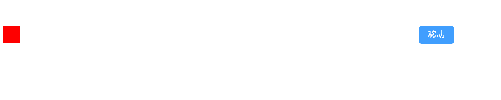

# targets 动画的目标对象

## 类型1 css选择器

+ 可以是任何 CSS 选择器
+ 不能使用 JavaScript 以伪元素为目标
+ 类型：字符串

  ```js
  anime({
    targets: '.css-selector-demo .el',
    translateX: 250
  });
  ```

  ```html
  <div class="item"> </div>
  <el-button type="primary" @click="move">移动</el-button>

  <!-- 通过.item 类获取到该元素，让后使其水平移动250px -->
  let move = () => {
      anime({
          targets: '.item',
          translateX: 250
      })
  }
  ```

  

## 类型2 DOM 节点 / NodeList

+ 可以是任何 DOM Node 或 NodeList

+ 类型

  + DOM 节点 `targets: el.querySelector('.item')`
  + NodeList `targets: el.querySelectorAll('.item')`

  ```js
  var elements = document.querySelectorAll('.dom-node-demo .el');

  anime({
    targets: elements,
    translateX: 270
  });
  ```

  

## 类型3 JS对象

+ 一个 JavaScript 对象，其中至少有一个属性包含数值

  ```js
  var logEl = document.querySelector('.battery-log');

  var battery = {
    charged: '0%',
    cycles: 120
  }

  anime({
    targets: battery,
    charged: '100%',
    cycles: 130,
    round: 1,
    easing: 'linear',
    update: function() {
      logEl.innerHTML = JSON.stringify(battery);
    }
  });
  ```

## 类型4 数组

+ 包含多个目标的数组
+ 接受混合类型。例如 `['.el', domNode, jsObject]`

  ```js
  var el = document.querySelector('.mixed-array-demo .el-01');

  anime({
    targets: [el, '.mixed-array-demo .el-02', '.mixed-array-demo .el-03'],
    translateX: 250
  });
  ```

  
