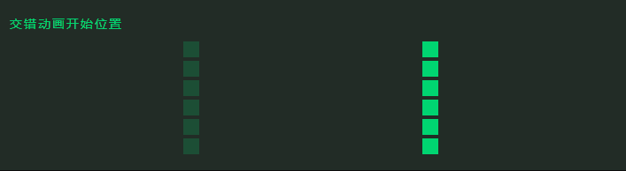
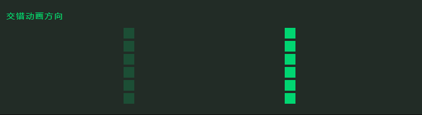
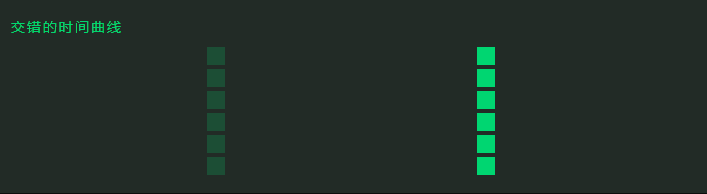
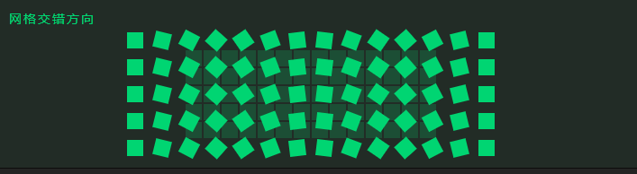

# 基础交错动画

## 概述

+ code

  ```js
  anime({
    targets: '.item',
    translateX: 270,
    delay: anime.stagger(1000) // 每个元素的延迟增加1000毫秒。
  })
  ```

  

## 设定交错开始值

+ 从特定值开始产生交错效果

  ```js
  anime({
    targets: '.staggering-start-value-demo .el',
    translateX: 270,
    delay: anime.stagger(100, {start: 500}) // 延迟从500ms开始，然后每个元素增加100ms。
  });
  ```

## 设定交错范围值

+ 在两个数字之间均匀分配值

  ```js
  anime({
    targets: '.range-value-staggering-demo .el',
    translateX: 270,
    rotate: anime.stagger([-360, 360]), // 旋转将在-360deg到360deg之间均匀分布在所有元素之间
    easing: 'easeInOutQuad'
  });
  ```

  

## 交错动画开始位置

+ 从特定位置开始交错效果

  + first(默认)，从第一个元素开始效果
  + laster，从最后一个元素开始效果
  + center，从中间开始效果
  + index，从指定索引开始效果

  ```js
  anime({
    targets: '.staggering-from-demo .el',
    translateX: 270,
    delay: anime.stagger(100, {from: 'center'})   //从中间开始执行效果，然后每个元素增加100毫秒
  });
  ```

  

## 交错动画方向

+ 更改交错动画的顺序

  + normal（默认），正常交错方向，从第一个元素到最后一个元素
  + reverse，倒退交错方向，从最后一个元素到第一个元素

  ```js
  anime({
    targets: '.staggering-direction-demo .el',
    translateX: 270,
    delay: anime.stagger(100, {direction: 'reverse'})
  });
  ```

  

## 交错的时间曲线

+ 使用easing函数设置交错值

  ```js
  anime({
    targets: '.staggering-easing-demo .el',
    translateX: 270,
    delay: anime.stagger(300, {easing: 'easeOutQuad'})
  });
  ```

  

## 网格交错

+ 基于数组的交错值，以产生“波纹”效应。两个值的数组，第一个值是列数，第二个值是行数

  ```js
  anime({
  targets: '.staggering-grid-demo .el',
    scale: [
      {value: .1, easing: 'easeOutSine', duration: 500},
      {value: 1, easing: 'easeInOutQuad', duration: 1200}
    ],
    delay: anime.stagger(200, {grid: [14, 5], from: 'center'})
  });
  ```

  

## 网格交错方向

+ 定义网格交错 效果的方向

  + x 沿着x轴
  + y 沿着y轴

  ```js
  anime({
    targets: '.staggering-axis-grid-demo .el',
    translateX: anime.stagger(10, {grid: [14, 5], from: 'center', axis: 'x'}),
    translateY: anime.stagger(10, {grid: [14, 5], from: 'center', axis: 'y'}),
    rotateZ: anime.stagger([0, 90], {grid: [14, 5], from: 'center', axis: 'x'}),
    delay: anime.stagger(200, {grid: [14, 5], from: 'center'}),
    easing: 'easeInOutQuad'
  });
  ```

  

