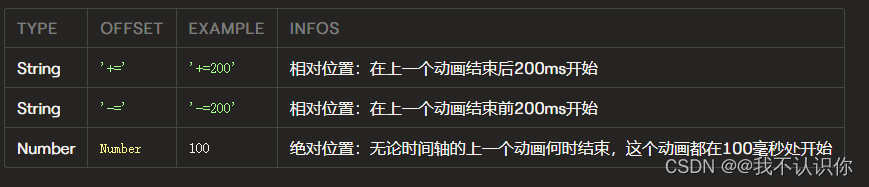

# 时间轴偏移量

## 概述

+ 可以使用时间轴的 .add()函数的第二个可选参数指定时间偏移
+ 它定义动画在时间轴中的开始时间，如果未指定偏移，则动画将在上一个动画结束后开始
+ 偏移可以相对于最后一个动画，也可以相对于整个时间轴

  

  ```js
  // 使用默认参数创建时间轴
  var tl = anime.timeline({
    easing: 'easeOutExpo',
    duration: 750
  });

  tl
  .add({
    targets: '.offsets-demo .el.square',
    translateX: 250,
  })
  .add({
    targets: '.offsets-demo .el.circle',
    translateX: 250,
  }, '-=600') // 相对偏移量
  .add({
    targets: '.offsets-demo .el.triangle',
    translateX: 250,
  }, 0); // 绝对偏移量
  ```


