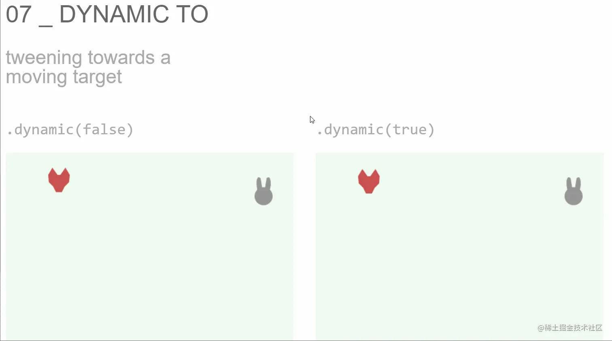

# 实例方法

## 开始 start

+ `start` 方法来控制tween动画的开始

  ```js
  let position = {x:100,y:100,z:100};
  let testTween = new TWEEN.Tween(position);

  testTween.start(); //开始

  testTween.stop(); //停止
  ```

+ `start(time?: number, bool?: boolean)`

  + time 如果你使用它，补间直到那个特定的时刻才会开始；否则它将立即开始（即在下一次调用 `TWEEN.update` 时）(表示动画将等待该时间之后执行，等同于 `delay`)
  + bool 当为 `true` 时，我们之前使用的补间将从目标对象中的值开始，而不是从头开始。用于停止补间，然后启动另一个将从当前位置继续的补间

+ `stop` 停止一个从未开始或已经停止的补间没有任何效果。 没有错误被抛出

## startFromCurrentValues

+ `tween.start(undefined, true)` 的别名，使以前使用的补间从目标对象的最后一个值开始，而不是从头开始

+ 使当前使用的补间从目标对象的上一个补间的最后一个值开始，而不是从头开始

## 停止 stop

+ `stop` 方法来控制tween动画的停止

  ```js
  let position = {x:100,y:100,z:100};
  let testTween = new TWEEN.Tween(position);

  testTween.start(); //开始

  testTween.stop(); //停止
  ```

## pause 暂停

+ 暂定补间动画 `new TWEEN.Tween().pause()` ， 暂停当前补间运动

  ```js
  const tween = new TWEEN.Tween(obj).to({ x: 100 }, 1000);

  tween.start();

  // 一段时间后暂停动画
  setTimeout(() => {
    tween.pause();
  }, 300);

  // 再过一段时间后恢复动画
  setTimeout(() => {
    tween.resume();
  }, 600);
  ```

## resume 恢复

+ 恢复补间动画 `new TWEEN.Tween().resume()` ， 恢复这个已经被暂停的补间运动

## update 更新

+ 这实际上是由 `TWEEN.update` 调用的，用于仅使用一个参数构建的补间

+ 在下面的示例中，第二个参数告诉新的 Tween 不要将自己添加到默认组（TWEEN 是 `TWEEN.Group` 的一个实例）
+ 如果补间不与组关联（请注意，可以通过将组作为第二个参数传递给构造函数来关联组），则补间需要使用其 update 方法手动更新，如下所示

  ```js
  const tween = new TWEEN.Tween(someObject, false).to(/*...*/).start()

  function animate(time) {
    tween.update(time)
    requestAnimationFrame(animate)
  }
  ```

+ 如果你使用 `TWEEN.update()` 作为默认控制所有补间的方式，则无需直接调用 `tween.update()`，但是我们建议你直接如上例所示 创建自己的补间组 或手动更新补间
+ 使用组或单独控制的补间的概念很像避免在 JavaScript 代码中使用全局变量的做法：它可以防止一个组件意外破坏其他一些不相关组件的行为

## chain 动画连续

+ 当你按顺序排列不同的补间时，事情会变得更有趣

+ 例如在上一个补间结束的时候立即启动另外一个补间
+ 我们称此为链接补间，它是通过 chain 方法完成的。因此，要使 tweenB 在 tweenA 完成后开始

  ```js
  tweenA.chain(tweenB)
  ```

+ 或者，可以创造一个无限的链式，tweenA 完成时开始 tweenB，tweenB 完成时开始 tweenA

  ```js
  tweenA.chain(tweenB)
  tweenB.chain(tweenA)
  ```

+ 在其他情况下，你可能希望将多个补间链接到另一个补间，使它们（链接的补间）都同时开始动画

  ```js
  tweenA.chain(tweenB, tweenC)
  ```

## repeat:Int 重复执行

+ repeat方法接收一个用于描述重复多少次的参数，无穷的话参数传递 `Infinity`

  ```js
  testTween.repeat(10); //重复执行10次然后停止
  testTween.repeat(Infinity); //动画一直执行
  ```

+ 比如某一个动画是从1变动到100，如果重复的话，到100之后会从1重新开始

## repeat 的 yoyo方法

+ yoyo方法只在 `repeat` 时起作用，只运行一次时没有效果
+ 传递参数 `boolean` ，当为 `true` 时，动画效果类似于yoyo球效果，动画在开始或结束处向反方向运行

  ```js
  tween.yoyo(false) // 默认值，动画只会从开始到结束值
  tween.yoyo(true) // tween 将在起始值和结束值之间“yoyo”
  ```

+ 比如某一个动画是从1变动到100，如果重复的话，到100之后会从1重新开始，如果使用yoyo，则到100之后会从100缓动到1，再从1缓动到100

## 延迟 delay

+ delay方法用来控制动画的延时

  ```js
  testTween.delay(1000); //延时1S执行
  tween.start(); // 将在调用 start 方法后的 1 秒钟后开始执行
  ```

## repeatDelay:Int

+ 通常 `delay` 时间应用于补间的重复之间，但如果向 `repeatDelay` 函数提供了一个值，则该值将确定补间重复之间经过的总时间

  ```js
  // 补间的第一次迭代将在一秒后发生，第二次迭代将在第一次迭代结束后半秒发生，第三次迭代将在第二次迭代结束后半秒发生，依此类推
  tween.delay(1000)
  tween.repeatDelay(500)
  tween.start()
  ```

+ 如果你想延迟初始迭代但不希望迭代之间有任何延迟，请确保调用 `tween.repeatDelay(0)`

## dynamic

+ 如果 `dynamic` 设置为 `true` （默认为 `false` ），则传递给 `tween.to()` 的对象可以在补间动画的外部进行修改

  + 这可用于在运行时动态修改补间的结果

+ 当 `dynamic` 设置为 `false` 时，Tween 复制传递给 `tween.to()` 的对象并且永远不会修改它（因此从外部更新原始对象不是动态的）

+ 当 `dynamic` 为 `true` 时，Tween 在动画期间使用原始对象作为值的来源（每次更新都读取值，因此可以动态修改它们） 但请注意，在 `dynamic` 模式下，Tween 将修改传递给 `tween.to()` 的对象的任何插值数组，这可能会对也可能依赖于同一对象的任何外部代码造成副作用

  

## stopChainedTweens

+ 停止所有链接在当前 Tween 对象之后的动画
+ 当使用 chain 方法链接多个动画时，调用此方法可以终止后续动画的执行

  ```js
  const obj = { x: 0 };
  const tween1 = new TWEEN.Tween(obj).to({ x: 100 }, 1000);
  const tween2 = new TWEEN.Tween(obj).to({ x: 200 }, 1000);
  tween1.chain(tween2);
  tween1.start();

  // 停止链接的 tween2 动画
  tween1.stopChainedTweens();
  ```

## seek(time:Number, pause:Boolean):Tween

+ 跳转Tween到指定的时间

+ 参数

  + time:Number — 指定要跳转的时间。取值范围为：0 - duraion
  + pause:Boolean — 是否暂停

+ 返回值

  + Tween — Tween变换本身。可用于链式调用
