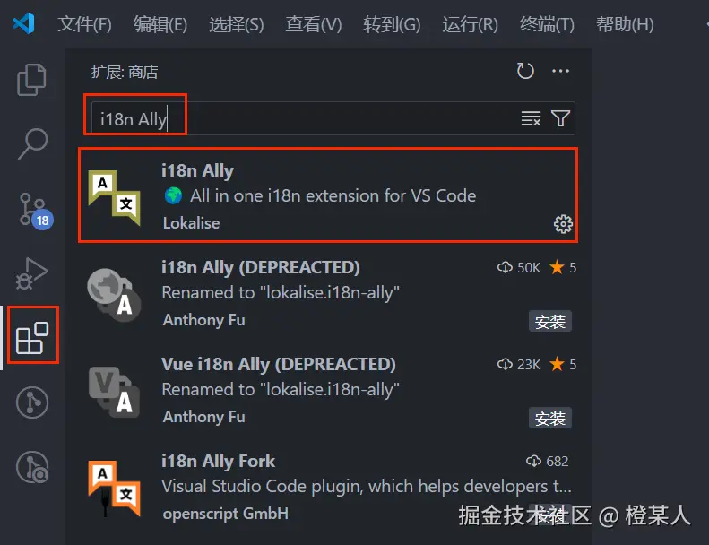
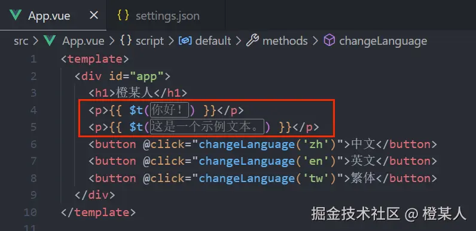

# i18n Ally

## 概述

+ i18n Ally 是一款 VS Code 插件，它能通过可视化操作的形式提高了开发者翻译多语言的效率，属于机器翻译，能省心不少；再去结合 vue-i18n 包（React 可以使用 react-i18next），咱们就能轻松完成项目国际化需求了

  

## 基本使用

+ 先设置 .vscode/settings.json 文件内容如下

  ```json
  {
    // 插件将以何种语言作为基准来进行翻译相关的操作，如果你正在开发一个多语言应用，并且原始文案是用英语编写的，你可以将`sourceLanguage`设置为`en`（代表英语）
    // 这样，插件就知道在提取文案进行翻译或者在代码中关联不同语言的文案时，以英语文案为原始参考
    "i18n-ally.sourceLanguage": "zh-CN",

    // 指定语言文件存储的位置，后续自动翻译的文案也会存到这个位置；数组的形式允许添加多个
    "i18n-ally.localesPaths": ["src/locales"],

    // 语言文件内部的数据结构，flat({"a.b.c": "..."}) or nested({"a": {"b": {"c": "..."}}}
    "i18n-ally.keystyle": "nested",

    // 设置当前显示的主体语言: zh-CN/en/zh-TW/...
    // "i18n-ally.displayLanguage": "zh-CN" 属性的值取的是你翻译文件或者文件夹的名称
    // 比如你将简体语言文件叫 zh-CN.json，则值就为 zh-CN，英文语言文件叫 en.json，则值就为 en
    // 可以不设置
    // "i18n-ally.displayLanguage": "zh-CN",

    // 翻译文案的属性名称策略：slug-拼音、random-随机、empty-需要手动命名
    "i18n-ally.extract.keygenStrategy": "slug",

    // 属性名称的具体生成规则
    "i18n-ally.extract.keygenStyle": "camelCase",

    // 指定框架
    "i18n-ally.enabledFrameworks": ["vue", "react"] // 默认为 auto
  }
  ```

  ```
  "i18n-ally.extract.keygenStyle" 规则的值有：

    default/kebab-case；拼音+短横杠，如 ming-cheng。
    snake_case；拼音+下划线，如 ming_cheng。
    camelCase；拼音+驼峰，如 mingCheng。
    PascalCase；拼音+驼峰+首字符大写，如 MingCheng。
    ALL_CAPS；拼音+下划线+全大写，如 MING_CHENG。
  ```

+ 显示效果

  

## 自动翻译

+ https://juejin.cn/post/7435521784881594395
