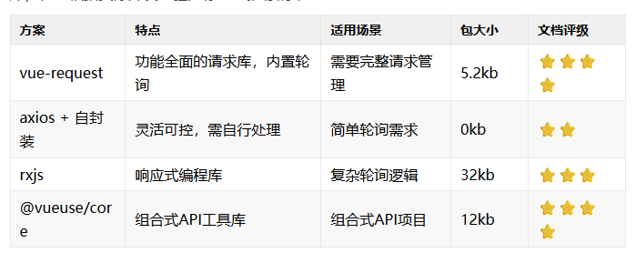

# 轮询

## 解决方案和库

+ 解决方案和库

  

## 方案1 推荐首选：vue-request（专为Vue3设计）

+ npm install vue-request

+ code

  ```html
  <script setup>
  import { useRequest } from 'vue-request';

  // 轮询获取数据示例
  const { data, loading } = useRequest(
    () => axios.get('/api/data'),
    {
      // 每3秒轮询一次
      pollingInterval: 3000,
      // 错误重试策略
      pollingWhenHidden: false, // 页面隐藏时暂停
      pollingErrorRetryCount: 3
    }
  );
  </script>

  <template>
    <div v-if="loading">加载中...</div>
    <div v-else>{{ data }}</div>
  </template>
  ```

## 方案2 原生方案：使用 Composition API 封装

+ 使用 Composition API 封装

  ```js
  // utils/usePolling.ts
  import { ref, onUnmounted } from'vue';

  exportfunction usePolling<T>(fn: () => Promise<T>, interval: number) {
    const data = ref<T>();
    const error = ref<Error>();
    const isPolling = ref(true);

    let timer: number;

    const execute = async () => {
      try {
        data.value = await fn();
      } catch (err) {
        error.value = err asError;
      } finally {
        if (isPolling.value) {
          timer = setTimeout(execute, interval);
        }
      }
    };

    const stop = () => {
      isPolling.value = false;
      clearTimeout(timer);
    };

    // 自动开始
    execute();

    // 组件卸载时自动清理
    onUnmounted(stop);

    return { data, error, stop };
  }
  ```

+ 使用

  ```js
  <script setup>
  import { usePolling } from './utils/usePolling';

  const { data, stop } = usePolling(
    () => fetch('/api/data').then(r => r.json()),
    5000
  );
  </script>
  ```

## 方案3 轻量级方案：@vueuse/core（推荐组合式API项目）

+ `@vueuse/core`

  ```html
  <script setup>
  import { useIntervalFn } from '@vueuse/core';

  const data = ref();
  const error = ref();

  // 每5秒执行一次
  const { pause, resume } = useIntervalFn(async () => {
    try {
      data.value = await axios.get('/api/data');
    } catch (err) {
      error.value = err;
      pause(); // 出错时暂停
    }
  }, 5000, { immediate: true });
  </script>
  ```

## 方案3 RxJS 方案（适合复杂场景）

+ code

  ```html
  <script setup>
  import { interval, switchMap } from 'rxjs';
  import { useObservable } from '@vueuse/rxjs';

  const poll$ = interval(3000).pipe(
    switchMap(() => from(axios.get('/api/data')))
  );

  const data = useObservable(poll$);
  </script>
  ```

## 选型建议

+ 简单场景
  👉 使用 @vueuse/core 的 useIntervalFn
  ✅ 优点：无需额外依赖，组合式API友好
  ⚠️ 注意：需自行处理错误和清理

+ 完整请求管理
  👉 选择 vue-request
  ✅ 优点：内置错误重试、缓存、节流等高级功能

+ 复杂轮询逻辑
  👉 采用 RxJS
  ✅ 优点：处理竞态条件、重试策略等复杂场景得心应手

+ 需要精细控制
  👉 自行封装（推荐 usePolling 方案）
  ✅ 优点：完全可控，适合特殊业务需求


