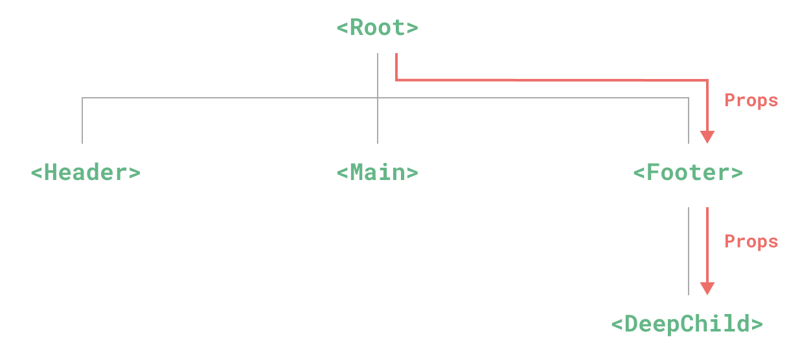

# Provide与Inject

## 概述

+ Props 逐级传递存在的问题

  

+ 整个依赖注入分为两个角色

  + 提供方：负责提供数据
  + 注入方 ：负责接收数据

## 提供方 provide

+ 要提供数据，可以使用 provide 方法

  ```js
  import { provide } from 'vue'

  provide(/* 数据名称 */ 'message', /* 实际数据 */ 'hello!')
  provide('message', 'hello!')
  ```

+ 该方法接收的参数也很简单：

  + 数据对应的名称
  + 实际的数据

## 注入方 inject

+ 注入方通过 inject 方法来取得数据

  ```js
  import { inject } from 'vue'

  const message = inject('message')
  ```

