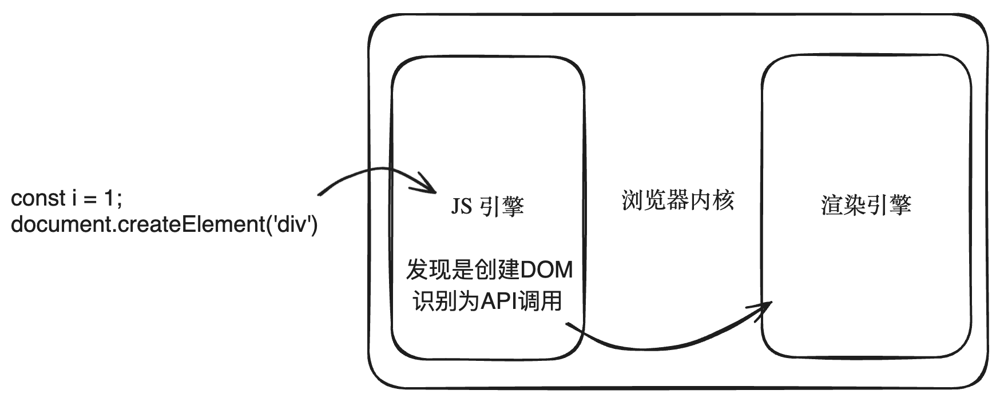

## DOM工作原理

## 概述

+ 写的代码是 JS 代码，但是浏览器引擎是 C++ 写的

  ```js
  const div = document.createElement("div");
  ```

+ 浏览器引擎（C++）拿到你这个 JS 代码是如何处理的？

+ 介绍一个东西：Web Interface Definition Language，WebIDL 翻译成中文“Web接口定义语言”
+ 这里就是定义浏览器和 JS 之间如何进行通信，换句话说，浏览器（C++实现的）所提供的一些功能（本地功能）如何能够被 JS 调用

+ 通过 WebIDL 浏览器开发者 可以描述哪些类和方法能够被 JS 访问，以及这些方法应该如何映射到 JS 中的对象和方法

+ 假设现在有如下的 WebIDL 定义，用于创建 DOM 元素

  ```js
  interface Document {
    Element createElement(DOMString localName);
  };
  ```

+ 这里就定义了一个 `Document` 的接口，该接口内部有一个 `createElement` 方法用来创建 DOM 元素的

+ 接下来 浏览器开发者 接下来使用 C++ 来实现这个接口

  ```js
  class Document {
  public:
      // 实现了上面的接口，定义了具体如何来创建 DOM 元素
      Element* createElement(const std::string& tagName) {
          return new Element(tagName);
      }
  };
  ```

+ 接下来的步骤非常重要，需要生成绑定代码（绑定层），绑定了 JS 如何调用这个 C++ 方法：

  ```js
  // 这个绑定代码是由 WebIDL 编译器自动生成
  // 这就是 JS 到 C++ 的绑定
  // 换句话说，这段绑定代码决定了 JS 开发者可以调用哪些方法从而来调用上面的 C++ 方法
  void Document_createElement(const v8::FunctionCallbackInfo<v8::Value>& args) {
      v8::Isolate* isolate = args.GetIsolate();
      v8::HandleScope handle_scope(isolate);
      Document* document = Unwrap<Document>(args.Holder());

      v8::String::Utf8Value utf8_value(isolate, args[0]);
      std::string localName(*utf8_value);

      Element* element = document->createElement(localName);
      v8::Local<v8::Value> result = WrapElement(isolate, element);
      args.GetReturnValue().Set(result);
  }
  ```

+ 有了绑定代码之后，接下来需要在 JS 引擎里面注册：

  ```js
  // 将上面的绑定代码注册到 JS 引擎里面
  void RegisterDocument(v8::Local<v8::Object> global, v8::Isolate* isolate) {
      v8::Local<v8::FunctionTemplate> tmpl = v8::FunctionTemplate::New(isolate);
      tmpl->InstanceTemplate()->Set(isolate, "createElement", Document_createElement);
      global->Set(v8::String::NewFromUtf8(isolate, "Document"), tmpl->GetFunction());
  }
  ```

+ Web 开发者在进行开发的时候，可以在 JS 文件中书写如下的代码：

  ```js
  const i = 1;
  document.createElement("div");
  ```

+ 首先是 JS 引擎来执行 JS 代码

  + 第一句是 JS 引擎完全能搞定的
  + 第二句 JS 引擎发现你要创建 DOM 节点，会将其识别为一个 API 调用，然后向浏览器底层（渲染引擎）发出请求，由浏览器底层（渲染引擎）负责来创建这个 DOM 元素
  + 浏览器底层创建完 DOM 元素之后，还需要给你最初的调用端返回一个结果，所谓最初的调用端，也就是 JS 代码中调用 DOM API 的地方

  

+ 平时我们所指的真实 DOM，究竟是在指什么？

  + 指的就是浏览器底层已经调用过 C++ 对应的 API 了

+ 假设你在 JS 层面

  ```js
  document.appendChild("div");
  ```

+ 那么浏览器底层在调用对应的 C++ 代码的时候，还会涉及到浏览器重新渲染的相关内容
