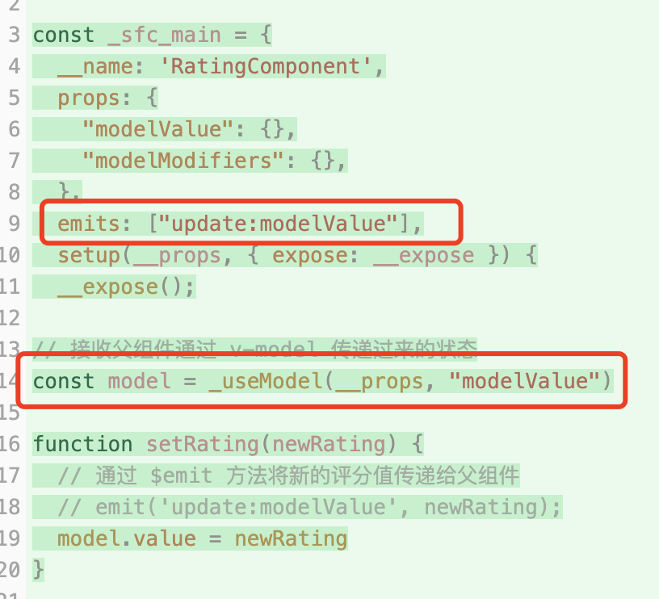

# v-model的本质

## 使用场景

+ v-model的用法，总结起来就是两个场景：

  + 表单元素和响应式数据双向绑定
  + 父子组件传递数据

## 和表单元素绑定

+ input 元素和 message 这个响应式数据做了双向绑定
+ input 元素所输入的值会影响 message 这个响应式数据的值；message 响应式数据的改变也会影响 input 元素

  ```html
  <template>
    <div>
      <p>输入的内容为：{{ message }}</p>
      <input type="text" v-model="message" placeholder="请输入内容" />
    </div>
  </template>

  <script setup>
  import { ref } from 'vue'
  const message = ref('Hello')
  </script>

  <style>
  input {
    padding: 8px;
    margin-top: 10px;
    border: 1px solid #ccc;
    border-radius: 4px;
  }
  </style>
  ```

+ 通过 vite-plugin-inspect 插件的编译结果来进行分析验证

  

+ 编译结果我们可以看出，v-model 会被展开为一个名为 onUpdate:modelValue 的自定义事件，该事件对应的事件处理函数

  ```js
  $event => ($setup.message) = $event;
  ```

+ 这就解释了为什么输入框输入的值的时候，会影响响应式数据。

+ 而输入框的 value 本身又是和 setup.message绑定在一起的， setup.message 一变化，就会导致渲染函数重新执行，从而看到输入框里面的内容发生了变化


## 和子组件进行绑定

+ 父组件通过 v-model 将自身的数据传递给子组件，子组件通过 defineModel 来拿到父组件传递过来的数据
+ 拿到这个数据之后，不仅可以使用这个数据，还可以修改这个数据

+ 父组件

  ```html
  <template>
    <div class="app-container">
      <h1>请给产品打分：</h1>
      <!-- 通过 v-model 将父组件的状态值传递给子组件 -->
      <RatingComponent v-model="rating"/>
      <p v-if="rating > 0">您的评分：{{ rating }}/5</p>
    </div>
  </template>

  <script setup>
  import { ref } from 'vue'
  import RatingComponent from '@/components/RatingComponent.vue'
  const rating = ref(3) // 评分的状态值
  </script>

  <style>
  .app-container {
    max-width: 600px;
    margin: auto;
    text-align: center;
    font-family: Arial, sans-serif;
  }

  p {
    font-size: 18px;
    color: #333;
  }
  </style>
  ```

+ 子组件

  ```html
  <template>
    <div class="rating-container">
      <span v-for="star in 5" :key="star" class="star" @click="setRating(star)">
        {{ model >= star ? '★' : '☆' }}
      </span>
    </div>
  </template>

  <script setup>
  // 接收父组件通过 v-model 传递过来的状态
  const model = defineModel()

  function setRating(newRating) {
    // 通过 $emit 方法将新的评分值传递给父组件
    // emit('update:modelValue', newRating);
    model.value = newRating
  }
  </script>

  <style scoped>
  .rating-container {
    display: flex;
    font-size: 24px;
    cursor: pointer;
  }

  .star {
    margin-right: 5px;
    color: gold;
  }

  .star:hover {
    color: orange;
  }
  </style>
  ```

+ 通过 vite-plugin-inspect 插件的编译结果来进行分析验证

  

+ 这里会向子组件传递一个名为 modelValue 的 props，props 对应的值就是 $setup.rating，这正是父组件上面的状态。

+ 除此之外向子组件也传递了一个名为 onUpdate:modelValue 的自定义事件，该事件所对应的事件处理函数：

  ```js
  // 该事件处理函数负责的事情：
  // 就是将接收到的值更新组件本身的数据 rating
  $event => ($setup.rating) = $event;
  ```

  

+ 对于子组件来讲，就可以通过 modelValue 这个props 来拿到父组件传递过来的数据，并且可以在模板中使用该数据

+ 当更新数据的时候，就去触发父组件传递过来的 onUpdate:modelValue 自定义事件，并且将新的值传递过去

+ 至此，你对官网的这句话

  + defineModel 是一个便利宏。编译器将其展开为以下内容：

    + 一个名为 modelValue 的 prop，本地 ref 的值与其同步；
    + 一个名为 update:modelValue 的事件，当本地 ref 的值发生变更时触发。

+ 有些时候在子组件上面使用 v-model 的时候，可以使用具名的 v-model，此时展开的 props 和自定义事件的名称会有所不同

  

  + Props：modelValue ---> title
  + 自定义事件：update:modelValue ---> update:title
