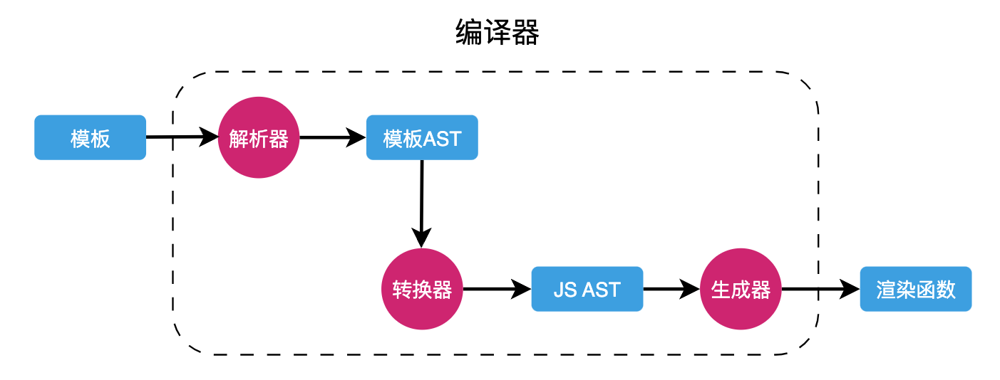

# 模板编译

## 概述

+ 单文件组件中所书写的模板，对于模板编译器来讲，就是普通的字符串

  ```html
  <template>
    <div>
      <h1 :id="someId">Hello</h1>
    </div>
  </template>
  ```

+ 对于模板编译器来讲，仅仅是一串字符串

  ```js
  '<template><div><h1 :id="someId">Hello</h1></div></template>'
  ```

+ 模板编译器需要对上面的字符串进行操作，最终生成的结果

  ```js
  function render(){
    return h('div', [
      h('h1', {id: someId}, 'Hello')
    ])
  }
  ```

+ 模板编译器在对模板字符串进行编译的时候，是一点一点转换而来的，整个过程

  

  + 解析器：负责将模板字符串解析为对应的模板AST
  + 转换器：负责将模板AST转换为 JS AST
  + 生成器：将 JS AST 生成最终的渲染函数

+ 每一个部件都依赖于上一个部件的执行结果

## 过程

+ 假设有这么一段模板

  ```html
  <div>
    <p>Vue</p>
    <p>React</p>
  </div>
  ```

+ 对于模板编译器来讲，就是一段字符串

  ```js
  "<div><p>Vue</p><p>React</p></div>"
  ```

+ 步骤1：首先是解析器，拿到这串字符串，对这个字符串进行解析，得到一个一个的 token

  ```js
  [
    {"type": "tag","name": "div"},
    {"type": "tag","name": "p"},
    {"type": "text","content": "Vue"},
    {"type": "tagEnd","name": "p"},
    {"type": "tag","name": "p"},
    {"type": "text","content": "React"},
    {"type": "tagEnd","name": "p"},
    {"type": "tagEnd","name": "div"}
  ]
  ```

+ 步骤2 接下来解析器还需要根据所得到的 token 来生成抽象语法树（模板的AST）

  ```js
  // 转换出来的 AST：
  {
    "type": "Root",
    "children": [
      {
        "type": "Element",
        "tag": "div",
        "children": [
          {
            "type": "Element",
            "tag": "p",
            "children": [
                {
                  "type": "Text",
                  "content": "Vue"
                }
            ]
          },
          {
            "type": "Element",
            "tag": "p",
            "children": [
                {
                  "type": "Text",
                  "content": "React"
                }
            ]
          }
        ]
      }
    ]
  }
  ```

+ 步骤3 转换器登场，它需要将上一步得到的模板 AST 转换为 JS AST：

  ```js
  {
    "type": "FunctionDecl",
    "id": {
        "type": "Identifier",
        "name": "render"
    },
    "params": [],
    "body": [
        {
            "type": "ReturnStatement",
            "return": {
                "type": "CallExpression",
                "callee": {"type": "Identifier", "name": "h"},
                "arguments": [
                    { "type": "StringLiteral", "value": "div"},
                    {"type": "ArrayExpression","elements": [
                          {
                              "type": "CallExpression",
                              "callee": {"type": "Identifier", "name": "h"},
                              "arguments": [
                                  {"type": "StringLiteral", "value": "p"},
                                  {"type": "StringLiteral", "value": "Vue"}
                              ]
                          },
                          {
                              "type": "CallExpression",
                              "callee": {"type": "Identifier", "name": "h"},
                              "arguments": [
                                  {"type": "StringLiteral", "value": "p"},
                                  {"type": "StringLiteral", "value": "React"}
                              ]
                          }
                      ]
                    }
                ]
            }
        }
    ]
  }
  ```

+ 步骤4 是生成器，根据上一步所得到的 JS AST，生成具体的 JS 代码

  ```js
  function render () {
    return h('div', [h('p', 'Vue'), h('p', 'React')])
  }
  ```

## 模板编译器结构

+ 一个模板编译器大致的结构

  ```js
  function compile(template){
    // 1. 解析器
    const ast = parse(template)
    // 2. 转换器：将模板 AST 转换为 JS AST
    transform(ast)
    // 3. 生成器
    const code = genrate(ast)

    return code;
  }
  ```


