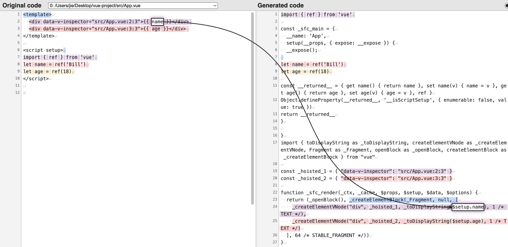

# 响应式和组件渲染

## 回顾

+ 模板的本质：对应的就是 render 渲染函数，该函数执行之后，会返回虚拟 DOM，这是一种用来描述真实 DOM 的数据结构

+ 响应式的本质：当数据发生变化的时候，依赖该数据的函数重新运行

+ 假设 render 函数运行期间用到了响应式数据会怎么样？

  + 结果很简单，那就是这个 render 函数会和响应式数据关联起来，当响应式数据发生变化的时候，所关联的 render 函数会重新运行，从而得到新的虚拟 DOM 结构，然后渲染器会根据新的虚拟 DOM 结构去更新真实 DOM 结构，从而在视觉感官上看到的是界面的变化

  + 这里说是重新运行 render，其实都还不是最准确的表达，实际上源码内部是和 updateComponent 方法进行的关联，而该方法的内部调用了 render 函数

## 模板编译

+ 在下面的代码中，模板用到了两个响应式数据，在模板中使用 ref 是会自动解包 value 的，因此这里就相当于在读取 vlaue 值，读取 value 就会产生读取的拦截，然后这两个响应式数据就会被模板背后所对应的渲染函数关联起来，有了依赖关系

  ```html
  <template>
    <div>{{ name }}</div>
    <div>{{ age }}</div>
  </template>

  <script setup>
  import { ref } from 'vue'
  let name = ref('Bill')
  let age = ref(18)
  </script>
  ```

+ 有了依赖关系之后，响应式数据的变化就会导致渲染函数（被监控的函数）重新执行，得到新的虚拟 DOM，从而 UI 得到更新

+ 下面是通过 vite-plugin-inspect 插件进行编译分析，从而验证上面的说法

  

+ 在 setup 函数中定义了响应式数据，会转变成一个 `_returned_` 的一个对象的访问器属性，针对这两个属性进行读取和赋值的时候，就会被拦截到。

+ 在 _sfc_render 渲染函数中，setup 所返回的对象通过 setup参数可以拿到，在渲染函数中，通过 `setup.name` 和 `$setup.age` 访问这两个访问器属性，产生读取行为的拦截，从而建立了依赖关系

## 为什么Vue能实现精准更新

+ Vue 的更新是组件级别的，通过响应式，能够知道具体是哪个组件更新了。

+ 因为响应式数据是和 render 函数关联在一起，整个 render 函数对应的就是一整个组件的结构，回头只要响应式数据一变化，render 函数就会重新执行，生成组件新的虚拟 DOM 结构

+ 之后要知道具体是哪一个节点更新，就需要靠 diff 算法了

  + Vue2: 双端 diff
  + Vue3: 快速 diff

## 为什么Vue能实现数据共享

+ 在 Vue 中是可以轻松实现数据共享的。只需要将响应式数据单独提取出来，然后多个组件依赖这个响应式数据，之后只要这个响应式数据一变，依赖该数据的组件自然也会重新运行 render，然后渲染器渲染新的 DOM

  ```js
  import { reactive } from 'vue'

  export const store = reactive({
    todos: [
      {
        id: 1,
        text: '学习Vue3',
        completed: false
      },
      {
        id: 2,
        text: '学习React',
        completed: false
      },
      {
        id: 3,
        text: '学习Angular',
        completed: false
      }
    ],
    addTodo(todo) {
      this.todos.push(todo)
    },
    toggleTodo(id) {
      const todo = this.todos.find((todo) => todo.id === id)
      if (todo) {
        todo.completed = !todo.completed
      }
    }
  })
  ```


