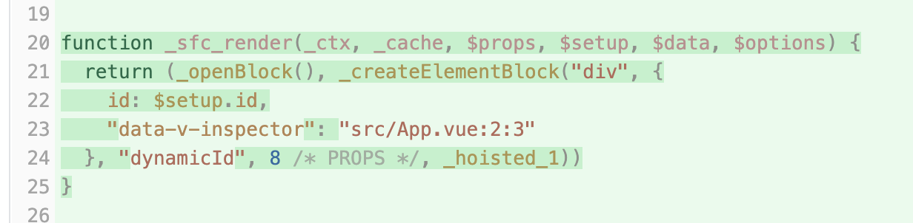

# 指令的本质

## 概述

+  Vue 的内置指令

  + v-if
  + v-show
  + v-for
  + v-model
  + v-html
  + v-bind
  + v-on
  + ......

+ 结合 vite-plugin-inspect 插件的编译结果来进行分析指令的本质

## 结论

+ 最终编译出来的渲染函数，根本不存在什么指令，不同的指令会被编译为不同处理

## v-if

+ 对于 `v-if` 指令，背后对应的就是三目运算符写的不同分支
+ 每一次 `$setup.type` 值的变化就会导致渲染函数重新执行，然后进入到不同的分支

  ```html
  <template>
    <div v-if="type === 1">type 的值为 1</div>
    <div v-else-if="type === 2">type 的值为 2</div>
    <div v-else-if="type === 3">type 的值为 3</div>
    <div v-else-if="type === 4">type 的值为 4</div>
    <div v-else>Not 1/2/3/4 is 0</div>
    <button @click="toogleFunc">Toggle</button>
  </template>

  <script setup>
  import { ref } from 'vue'
  const type = ref(1)
  function toogleFunc() {
    type.value = Math.floor(Math.random() * 5)
  }
  </script>
  ```

+ 编译结果如下

  [text](指令的本质.md)

## v-for

+ 生成的渲染函数里面，用到了一个名为 renderList 的内部方法

  + renderList：packages/runtime-core/src/helpers/renderList.ts

  ```html
  <template>
    <div>
      <h2>商品列表</h2>
      <ul>
        <!-- 使用 v-for 遍历 products 数组，渲染每个商品的信息 -->
        <li v-for="(product, index) in products" :key="index">
          {{ product.name }} - ${{ product.price }}
        </li>
      </ul>
    </div>
  </template>

  <script setup>
  import { ref } from 'vue'
  const products = ref([
    { name: '键盘', price: 99.99 },
    { name: '鼠标', price: 59.99 },
    { name: '显示器', price: 299.99 }
  ])
  </script>
  ```

+ 编译后的结果如下

  

## v-bind

+ 就是将 setup.id的值作为div的id属性值，这里涉及到了响应式数据的读取，因此 setup.id 的值发生变化的时候，渲染函数会重新执行，div 对应的属性也会发生变化

  ```html
  <template>
    <div v-bind:id>dynamicId</div>
  </template>

  <script setup>
  import { ref } from 'vue'
  const id = ref('my-id')
  </script>

  <style lang="scss" scoped></style>
  ```

+ 编译后的结果如下

  

## v-on

+ 编译结果就是为 button 元素添加上了 click 事件，该事件对应的事件处理函数为

  ```js
  $event => $setup.count++
  ```

  ```html
  <template>
    <div>{{ count }}</div>
    <button v-on:click="count++">+1</button>
  </template>

  <script setup>
  import { ref } from 'vue'
  const count = ref(0)
  </script>
  ```

+ 编译结果如下

  
