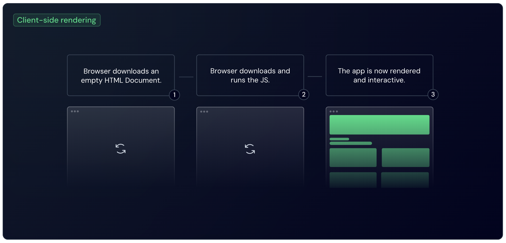

# SPA

## 概述

+ Nuxt3 是一个全栈的上层框架，提供多种渲染模式的，因此自然也是支持 SPA 渲染模式的

  

+ 在 Nuxt3 中要启用 SPA 渲染模式：

  ```js
  // nuxt.config.ts
  export default defineNuxtConfig({
    ssr: false, // 关闭服务端渲染（SSR），启用 SPA 模式
  });
  ```

