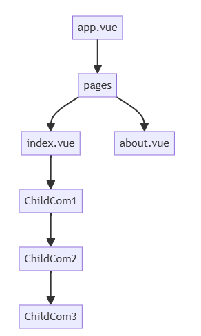

# 相关内置组件

## 概述

+ `NuxtErrorBoundary` ：这是一个处理错误边界的组件，将可能出错的组件放置于错误边界组件内，即便出现错误，错误组件上面的组件也不会受错误影响，能够正常渲染出来

+ 当前组件树结构如下：

  

+ ChildCom3有错误的话，会导致整个首页都崩溃，渲染不出来
+ 这个时候可以使用错误边界组件，包裹可能出错的组件，从而不影响组件树上面的组件

