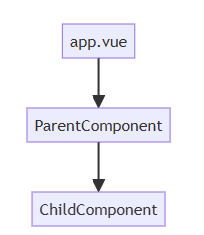

# 不同阶段错误

## 概述

+ 两个重要的阶段：

  + Vue渲染周期中的错误
  + 启动阶段错误

## Vue渲染周期错误

+ 就是在渲染Vue组件的时候出错了。

  + onErrorCaptured
  + errorHandler
  + vue:error

### onErrorCaptured

+ 这是 Vue 内置的钩子方法，可以捕获当前组件以及子组件的所有错误，然后进行局部处理

  

+ 假设在 ChildComponent 组件中有错误，我们在 ParentComponent 组件里面设置 onErrorCaptured 钩子方法来捕获错误，进行局部处理

### errorHandler

+ 同样是 Vue 提供的全局错误捕获方法。

+ 所谓全局，就是指不是放在某一个组件里面，而是作为错误冒泡的重点，是错误对象最终到达的地方。

+ 在这个全局错误捕获方法中，就可以对所有的错误进行一个统一的处理，例如根据错误码给出不同的处理，将错误统一进行上报之类的。

+ 示例：

  ```js
  // plugins/error-handler.ts
  export default defineNuxtPlugin((nuxtApp) => {
    console.log("插件已加载");
    nuxtApp.vueApp.config.errorHandler = (error, instance, info) => {
      console.error("全局错误处理：", error);
      console.log("组件实例", instance);
      console.log("错误来源", info);
      // 比如上报错误到第三方服务：
      // reportError(error)
    };
  });
  ```

+ 需要注意，如果在组件的onErrorCaptured里面针对捕获到的错误，做了局部处理，并且 return false，表示这个错误已经被处理过了，就不会继续向上冒泡，换句话说，不会到达全局错误处理器

### vue:error

+ Nuxt 中提供了一个 vue:error 的钩子，这同样是一个全局的错误捕获方法。它和 errorHandler 的区别如下：

  + errorHandler：通常只针对每个未处理的错误触发一次。
  + vue:error：如果某个错误在组件渲染、卸载或重新挂载时重复出现，或者组件本身多次创建、销毁（例如通过 v-if 切换显示），就可能导致 vue:error 钩子被触发多次。

+ 另外 vue:error 由于是 Nuxt 所提供的钩子方法，因此能够更好的和 Nuxt 融合，提供 SSR 的支持。

## 启动阶段错误

+ 整个 Nuxt 应用启动过程中，会经历多个过程，例如插件的运行，生命周期钩子函数的执行，SSR 以及客户端渲染。那么在这些过程中，都有产生错误的可能。例如：

  + 加载插件时插件里面的代码存在错误
  + app:created 和 app:beforeMount 钩子做初始化工作时发生异常，比如访问了不存在的属性或者执行了错误的逻辑
  + SSR 阶段组件渲染异常，例如数据获取失败、计算属性出错等
  + 客户端渲染时出错，不过此阶段的错误一般建议用 onErrorCaptured 或 vue:error 来进行处理
  + 处理 app:mounted 钩子时出错

+ 以上阶段出现的错误，都会被视为启动阶段错误

+ 在 Nuxt 中，可以设置一个 app:error 的钩子，能够捕获到这些启动阶段的错误。

+ 同样是在插件中进行注册，如下：

  ```js
  // plugins/startup-error-handler.ts
  export default defineNuxtPlugin((nuxtApp) => {
    nuxtApp.hook('app:error', (error) => {
      console.error("启动错误捕获：", error);
      // 这里可以做统一的错误上报，或者根据错误类型渲染不同的错误页面
      // 例如：reportErrorToService(error);
    });
  });
  ```
