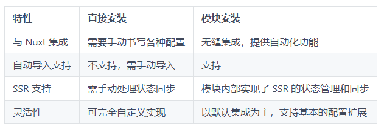

# Nuxt 模块

## 概述

+ Nuxt模块生态：https://nuxt.com/modules

## 模块的优势：

+ 模块的优势：

  

+ 安装完成后需要在配置文件中添加模块配置。（部分模块会自动写入配置信息）

## 课堂练习

+ 安装 element plus 模块。elemnt-nuxt 模块有如下特点：

  + 按需自动导入组件和样式
  + 按需求自动导入指令和样式
  + 自动从 @element-plus/icons-vue 导入图标
  + 自动导入ElMessage、ElNotification等方法
  + 自动将 ID_INJECTION_KEY 和 ZINDEX_INJECTION_KEY 注入 Vue
  + 自动将 teleport 注入到最终 html 页面的正确位置
