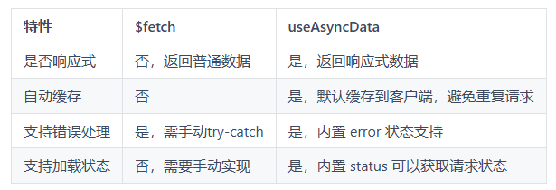

# 请求数据

## 概述

+ SSR运行流程

  

+ Nuxt 中做请求的 api，有 3 个：

  + `$fetch`
  + `useAsyncData`
  + `useFetch`

## 方式1 $fetch

+ 基于 `ofetch` 封装的工具
+ `ofetch` 这个工具也是 Nuxt3 官方团队成员推出的，特点：

  + 自动 JSON 解析
  + 更友好的错误处理
  + 丰富的配置项
  + 类型安全
  + 拦截器
  + ......

+ `ofetch` 能够自动解析 JSON：

  ```js
  // 原生 fetch
  const response = await fetch('/api/data');
  const data = await response.json();
  ```

  ```js
  // ofetch
  const data = await ofetch('/api/data');
  ```

+ 更友好的错误处理:

  ```js
  // 使用原生 fetch
  // fetch的设计哲学：只关注网络请求本身是否成功（DNS解析是否失败，是否超时等...）
  // 因此在 fetch 中即便返回 4xx 或者 5xx 的响应，fetch依然认为这次网络请求是成功的
  // 需要手动判断 response.ok 或者 response.status 来决定是否抛出错误
  try {
    const response = await fetch('https://jsonplaceholder.typicode.com/404');
    if (!response.ok) {
      throw new Error(`HTTP error! status: ${response.status}`); // 手动检查状态码并抛出
    }
    const data = await response.json();
  } catch (error) {
    console.error('Error:', error.message);
  }
  ```

  ```js
  // 使用 ofetch
  await ofetch('https://jsonplaceholder.typicode.com/404').catch(err=>err.data)
  ```

+ 支持设置常用配置项：

  ```js
  // 使用原生 fetch
  const baseURL = 'https://jsonplaceholder.typicode.com';
  const response = await fetch(`${baseURL}/posts`); // 手动拼接路径
  const postsNative = await response.json();
  console.log(postsNative);
  ```

  ```js
  // 使用 ofetch
  await fetch('/posts', {
    baseURL: 'https://jsonplaceholder.typicode.com'
  });
  ```

+ 请求响应拦截器:

  ```js
  // 使用原生 fetch
  // 需要自己去封装请求响应拦截的逻辑
  async function fetchWithInterceptors(url, options = {}) {
    // 请求拦截
    options.headers = { ...options.headers, Authorization: 'Bearer token123' };
    console.log('Request started:', options);

    const response = await fetch(url, options);

    // 响应拦截
    console.log('Response received:', response.status);

    return response.json();
  }
  await fetchWithInterceptors('https://jsonplaceholder.typicode.com/posts');
  ```

  ```js
  // 使用 ofetch
  // 提供了对应的钩子
  await ofetch('/api', {
    async onRequest({ request, options }){
      // 请求拦截的钩子
    },
    async onResponse({ request, response, options }){
      // 响应拦截的钩子
    }
  })
  ```

+ $fetch 是基于 ofetch 封装的工具，在 ofetch 的基础上：

  + 自动适配 Nuxt 环境
  + 内置 Nuxt 模块集成
  + Nuxt 错误处理集成
  + 服务端数据注入

+ 一句话概括：$fetch 与 Nuxt 的功能深度集成，能减少配置和重复代码，提升开发效率

+ $fetch 示例：

  ```html
  <template>
    <div>App page</div>
  </template>
  <script setup>
  const data = await $fetch("http://localhost:7001/users");
  console.log(data);
  </script>
  ```
+ 上面的例子中，使用$fetch会有两次请求，服务器端请求一次，客户端也会请求一次

## 方式2 useAsyncData

+ 如果想要避免重复请求的情况，可以使用 useAsyncData，这是一个 Nuxt 内置的组合式函数，数据仅在服务器端请求一次，然后会有缓存，可以有效避免客户端的重复请求。基础语法如下：

  ```html
  <script setup lang="ts">
  const { data, status, error, refresh, clear } = await useAsyncData(
    'mountains',
    () => $fetch('https://api.nuxtjs.dev/mountains')
  )
  </script>
  ```

+ 参数：

  + key：为 useAsyncData 提供一个唯一标识符

    + Nuxt 根据提供的 key 检查是否已有缓存
    + 如果缓存存在且有效，直接返回缓存数据
    + 如果没有缓存或缓存失效，则调用 fetcher 函数获取数据

  + fetcher 函数：定义如何获取数据

  ```html
  <template>
    <div>App page</div>
  </template>
  <script setup>
  const { data } = await useAsyncData("userList", () =>
    $fetch("http://localhost:7001/users")
  );
  console.log(data.value);
  </script>
  ```

## $fetch 与 useAsyncData

+ 相比 $fetch，useAsyncData 除了能够缓存数据以外，还内置了更多特性，例如错误状态、工具函数等。这是该方法的返回值：

  + data：存储异步数据请求的结果，并且这是一个响应式数据
  + status：表示请求的当前状态
  + error：存储请求过程中发生的错误
  + refresh：是一个函数，用于重新触发数据请求

    + 当数据需要实时更新时，可以调用 `refresh( )` 强制刷新数据

  + clear：是一个函数，用于清除当前数据的缓存

  

+ 整体来讲，useAsyncData 相比 $fetch 更加方便.

+ 场景示例：从一个 API 获取文章数据并渲染到页面上，同时支持以下功能：

  + 显示加载状态
  + 数据请求完成后展示文章列表
  + 在点击按钮时刷新数据

+ $fetch示例代码

  ```html
  <template>
    <div>
      <button @click="fetchPosts" :disabled="loading">刷新数据</button>
      <div v-if="loading">加载中...</div>
      <ul v-else>
        <li v-for="post in posts" :key="post.id">{{ post.title }}</li>
      </ul>
    </div>
  </template>

  <script setup>
  const posts = ref([]) // 存储文章列表
  const loading = ref(false); // 加载的状态

  const fetchPosts = async ()=>{
    loading.value = true;
    try{
      posts.value = await $fetch('/api/posts');
    } finally {
      loading.value = false;
    }
  }
  fetchPosts();
  </script>
  ```

+ useAsyncData示例代码

  ```html
  <template>
    <div>
      <button @click="refresh" :disabled='pending'>刷新数据</button>
      <div v-if="pending">加载中...</div>
      <ul v-else>
        <li v-for="post in posts" :key="post.id">{{ post.title }}</li>
      </ul>
    </div>
  </template>

  <script setup>
  const { data: posts, pending, refresh} = await useAsyncData('posts', ()=>$fetch('/api/posts'));
  </script>
  ```

+ 总结：

  + `$fetch`: 方法灵活性高，可以在任何地方使用
  + `useAsyncData`: 为服务端渲染（SSR）或组件挂载之前的数据获取场景设计，返回响应式数据以及一系列工具函数

    + 如果是在组件已经挂载后使用，Nuxt 会给出一个警告：Component is already mounted, please use $fetch instead.

## 方式3 useFetch

+ 语法糖，针对 useAsyncData 和 $fetch 做了一层封装，该组合式函数会根据 URL 以及 fetch 选项自动生成 `key` ，不需要开发人员手动提供 `key`

  ```js
  const { data } = await useFetch("http://localhost:7001/users");
  console.log(data.value);
  ```
