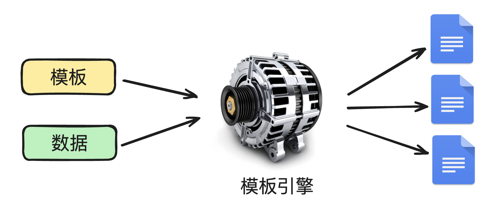
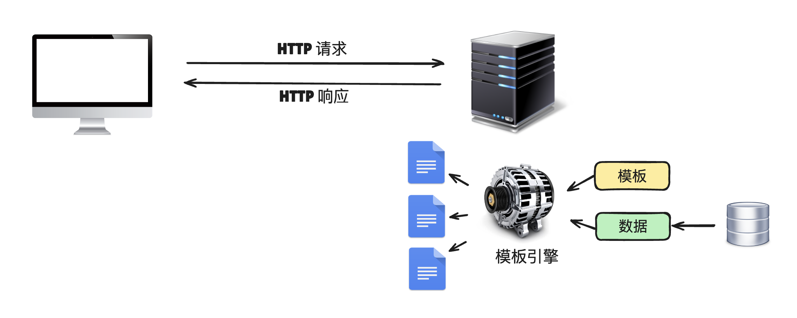
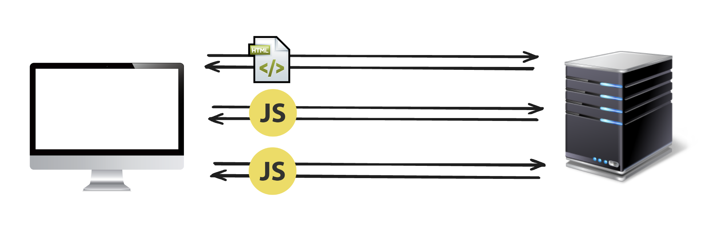
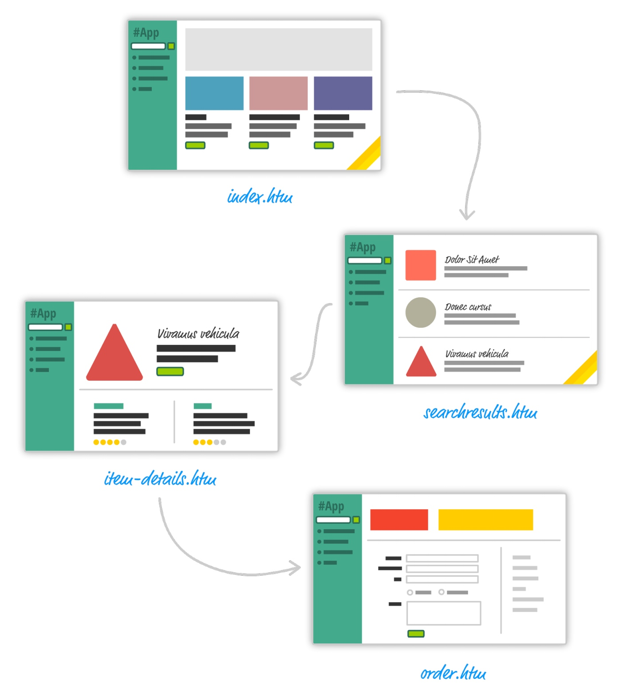
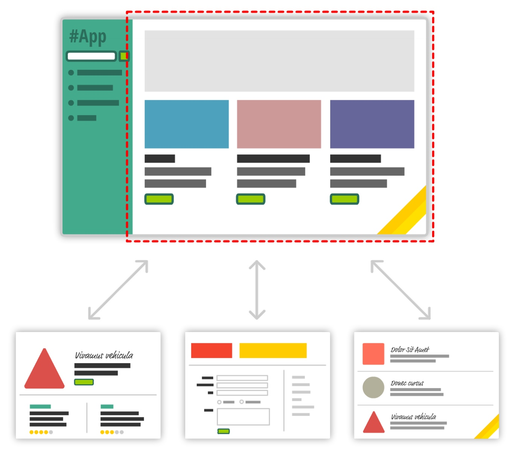
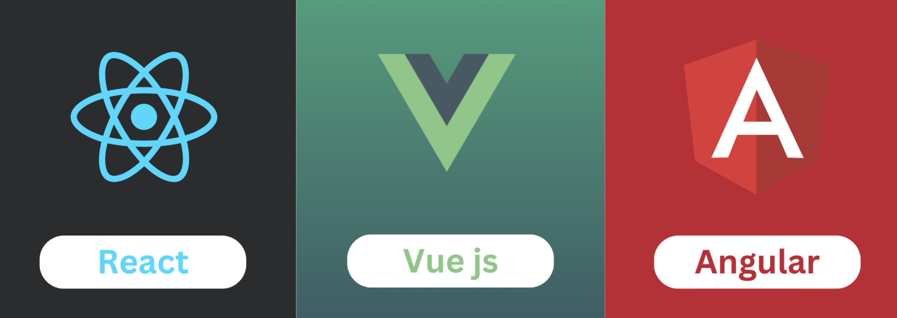
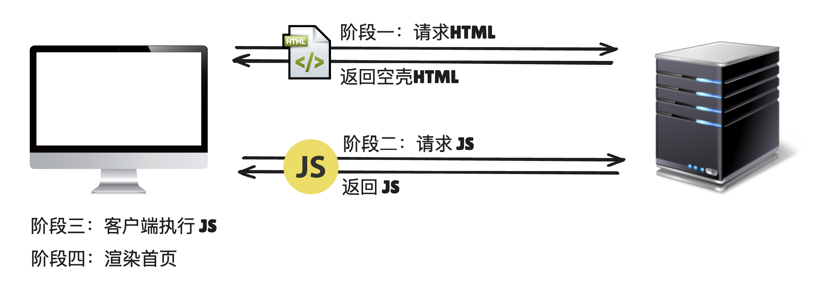
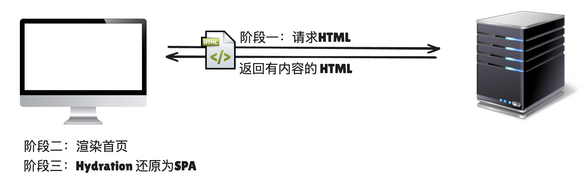

# web应用变迁史

## 概述

+ ssr：server side render 服务器端渲染

+ csr：client side render 客户端渲染（SPA：single page application）

+ 整个 Web 的发展分为 4 个阶段：

  + 静态页面
  + 动态页面
  + 单页应用
  + 服务器端渲染

## 静态页面阶段

+ HTML 诞生早期，是为了分享科学论文和研究文档。

+ HTML 由蒂姆·伯纳斯-李（Tim Berners-Lee）在1989年发明。当时，他在瑞士的欧洲核子研究组织（CERN）工作。他的目标是创建一种方便科学家们共享和访问研究文档和数据的方法
+ 蒂姆·伯纳斯-李提出了一个基于超文本的系统，这个系统允许研究人员通过点击链接在不同文档之间导航
+ 这个想法后来发展成为万维网（World Wide Web），HTML 作为其核心标记语言，用于创建和连接文档

+ 这个时期的 Web 应用就是以静态页面的姿态存在的

  

## 动态页面阶段

+ 静态页面问题：有一些页面仅仅是数据不同，页面的结构、样式什么的都是一模一样的。

+ 此时，一些服务端技术以及对应的模板引擎应运而生。模版引擎原理如下

  

+ 不同的服务器端技术会有不同的模板引擎，甚至就算是同一种服务器端技术，都会有好几种不同的模板引擎：

  + Java：JSP、Thymeleaf、Velocity、Freemarker
  + PHP：Smarty、Twig、HAML、Liquid、Mustache、Plates
  + Python：pyTenjin、Tornado.template、PyJade、Mako、Jinja2
  + C#：Razor、RazorLight、RazorEngine、Scriban、DotLiquid、Nustache、Handlebars.Net
  + Ruby：ERB、Haml、Slim、Liquid、Rabl、Tilt、Mustache

+ JSP 模板引擎

  ``html
  <h1>
    <%= title %>
  </h1>
  <ul>
    <%
      for (int i = 0; i < supplies.size(); i++) {
        String supply = supplies.get(i);
    %>
    <li>
      <a href='supplies/<%= supply %>'>
        <%= supply %>
      </a>
    </li>
    <%
      }
    %>
  </ul>
  ```
+ Smarty 模板引擎

  ```html
  <h1>
    {$title}
  </h1>
  <ul>
    {foreach from=$supplies item=supply}
    <li>
      <a href='supplies/{$supply}'>
        {$supply}
      </a>
    </li>
    {/foreach}
  </ul>
  ```

  

## 单页应用阶段

+ 2005 年，Ajax 技术诞生了，这标志着在客户端可以动态的修改页面内容。发送请求再也不是每次都要请求一整个页面，而是请求一段数据，之后使用 DOM 技术动态的更新页面内容。

+ 客户端渲染：请求的时候仅仅请求一个空页面，之后再去请求一大堆的 JS 文件

  

+ 浏览器一开始拿到的空页面结构，大致如下：

  ```html
  <!DOCTYPE html>
  <html lang="en">
  <head>
      <meta charset="UTF-8">
      <meta name="viewport" content="width=device-width, initial-scale=1.0">
      <title>CSR应用</title>
      <link rel="stylesheet" href="styles.css">
  </head>
  <body>
      <div id="app"></div>
      <script src="main.js"></script>
  </body>
  </html>
  ```

+ 这标志着 HTML 页面只需要一个，之后无论你要呈现什么内容，我都通过 JS 来动态呈现，而不是像以前那样要请求一个新的页面。至此，“单页应用”时代来临

+ 多页网站：

  

+ 单页应用

  

+ 现代前端框架：

  

+ 特点：

  + 由数据驱动视图

  + 组件化开发

  + 前端路由

    + 以前后端路由是提供对应的页面
    + 现在后端路由是提供对应的数据

  + 状态管理库


## 4. 服务器端渲染阶段

+ 服务器端渲染阶段

  

+ CSR 问题：

  + 首次加载时间长：白屏时间过长
  + SEO问题：SEO 英语全称是 Search Engine Optimization
  + 新的渲染方案出现了，这就是 SSR，“服务器端渲染”。仅仅渲染首屏内容，当带有首屏内容的 HTML 到达客户端后，会有一个 Hydration（水合）的操作，此时页面会重新变为一个单页应用

  

+ SSR 渲染的方式并不是银弹，是否要使用 SSR 取决于应用具体的需求
