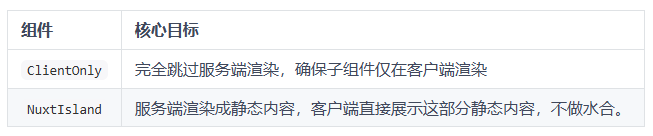

# 客户端渲染组件

## 概述

+ ClientOnly
+ NuxtIsland

## ClientOnly

+ 只在客户端进行渲染。基础语法如下：

```html
<ClientOnly>
  <div>这段内容只会在客户端渲染</div>
</ClientOnly>
```

+ 在 SSR 场景下，<ClientOnly> 包裹的内容会被完全跳过，等到客户端激活后再渲染。这对于那些在服务器端渲染时可能导致问题的代码非常有用。例如有一些第三方库依赖浏览器环境（window、document、navigator）


+ <ClientOnly> 提供了服务端渲染期间的占位内容。也就是说，在客户端渲染之前，服务端会渲染备用内容。指定占位内容的方式有两种：

  + 通过 props 的方式

    ```html
    <ClientOnly fallback-tag="div" fallback="评论加载中...">
      <Comment />
    </ClientOnly>
    ```

  + 通过插槽的方式

    ```html
    <ClientOnly fallback-tag="div">
      <Comment />
      <template #fallback>
        <!-- 服务器渲染时的占位内容 -->
        <p>评论加载中...</p>
      </template>
    </ClientOnly>
    ```

+ 与 <ClientOnly> 类似的还有 <DevOnly>，内部的内容仅在开发环境下渲染。例如：

  ```html
  <DevOnly>
    <!-- 该组件仅在开发环境渲染 -->
    <LazyDebugBar />

    <!-- 同样支持占位 -->
    <template #fallback>
      <div><!-- 占位内容 --></div>
    </template>
  </DevOnly>
  ```

## 岛屿组件

+ 英文是 Island Components. 岛屿组件的核心思想是不做水合。

+ 传统的 SSR 应用中，服务器会生成完整的首屏页面，然后客户端拿到首屏的 html 后再做水合操作，将整个页面转为可以交互的实例

  

+ 在这一过程中，从静态 html 转为 Vue 实例，涉及到生成虚拟 DOM以及响应式数据，这一过程是存在性能消耗的。

+ 例如：

  ```html
  app.vue

  <template>
    <h1>我的博客</h1>
    <button @click="count++">+1</button>
    <Blog/>
  </template>
  <script setup>
  const count = ref(0)
  </script>
  ```

  ```html
  Blog.vue

  <template>
    <div>
      <h1>博客标题</h1>
      <div>
        <!-- 博客正文 -->
        <!-- 10,000 字的静态内容 -->
      </div>
    </div>
  </template>
  ```

+ 这种场景可以使用岛屿组件：

  ```html
  <NuxtIsland name="Blog" />
  ```

  ```html
  app.vue
  <template>
    <h1>我的博客</h1>
    <button @click="count++">+1</button>
    <NuxtIsland name="Blog" />
  </template>
  <script setup>
  const count = ref(0)
  </script>
  ```

+ 有些时候，组件的内容是由 props 传入的，此时也可以使用岛屿组件。例如：

  ```html
  Blog.vue

  <template>
    <div>
      <h1>{{ article.title }}</h1>
      <div v-html="article.content"></div>
    </div>
  </template>
  <script setup>
  defineProps({
    article: Object
  })
  </script>
  app.vue

  <template>
    <h1>我的博客</h1>
    <button @click="count++">+1</button>
    <NuxtIsland name="Blog" :props="{ article }"/>
  </template>
  <script setup>
  const count = ref(0)
  </script>
  ```

+ 此时岛屿组件的工作流程：

  1. 初次渲染时：Blog 在服务器端生成好静态的 HTML 返回给客户端，客户端直接展示不做水合。
  2. props改变时：与之前 SPA 在客户端更新内容的方式有区别，因为没有做水合，该组件不具备客户端交互的能力。因此这里props发生变化的时候，会向服务器重新发请求生成新的html结构，返回给客户端进行更新。

+ 岛屿组件适用场景就是展示大片静态内容的场景。

## ClientOnly 与 NuxtIsland

+ 区别

  

+ 实际使用哪个，需要根据具体的场景来进行选择。

+ 由于 NuxtIsland 目前处于实验阶段，使用前需要在 nuxt.config.ts 中启用 experimental.componentIslands 选项

  ```js
  export default defineNuxtConfig({
    experimental: {
      componentIslands: true  // 或 'local+remote' 支持远程加载
    }
  })
  ```
