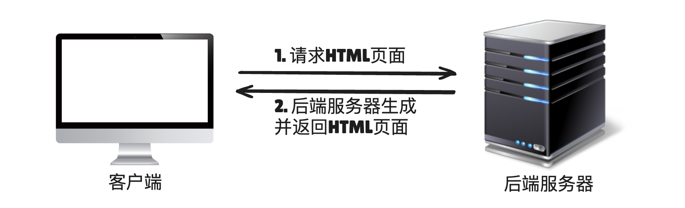

# 部署方案

## 部署方案

+ 客户端-后端服务器
+ 客户端-静态资源服务器-后端服务器
+ 客户端-中间服务器-后端服务器

## 客户端-后端服务器

+ 客户端-后端服务器：客户端文件（HTML、CSS、JS）和后端服务器端代码都托管在同一个服务器上（使用模板引擎的动态应用阶段）

  

## 客户端-静态资源服务器-后端服务器

+ 客户端-静态资源服务器-后端服务器：静态服务器（如 Nginx 或 CDN）托管和提供静态文件的服务，而后端服务器（如 Node.js、Python、Java 等）处理 API 请求和业务逻辑（CSR客户端渲染阶段）

  

## 客户端-中间服务器-后端服务器

+ 中间服务器负责生成 HTML 页面，而后端服务器处理数据和业务逻辑
+ 客户端向中间服务器请求页面时，中间服务器会从后端服务器获取数据，生成完整的首屏 HTML 页面并返回给客户端。（SSR 服务器端渲染阶段）

  
