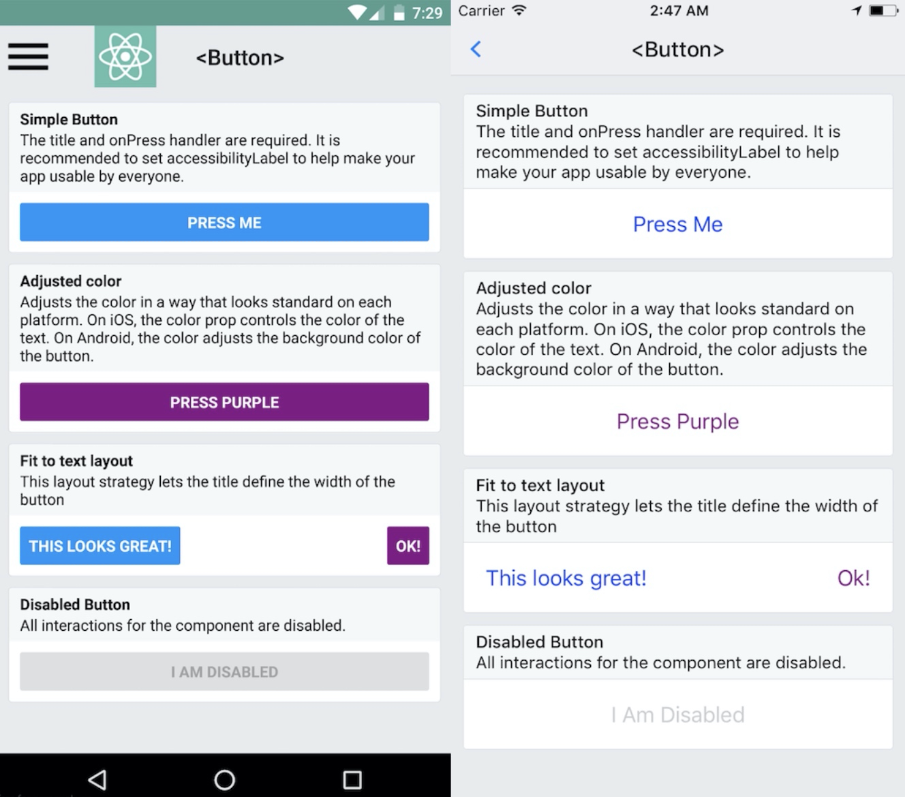

# 按钮Button组件

## 概述

+  RN 中提供了 Button 组件来渲染按钮，这是一个简单的跨平台的按钮组件，会调用原生环境中对应的按钮组件

+ 在 Android 设备中，Button 组件显示为一个按钮，而在 IOS 设备中，则显示为一行文本

  

## 组件

+  RN 中提供了 Button 组件来渲染按钮，这是一个简单的跨平台的按钮组件，会调用原生环境中对应的按钮组件

+ 该组件需要传递两个必须的属性

  + 一个是 `onPress` ，对应点击后的事件
  + 一个是 `title` ，用来指定按钮内的文本信息

  ```js
  import React from "react";
  import { View, StyleSheet, Button } from "react-native";

  export default function App() {
    function onPressLearnMore() {
      alert("this is working");
    }
    return (
      <View style={styles.container}>
        <Button title="这是一个测试按钮" onPress={onPressLearnMore}></Button>
      </View>
    );
  }

  const styles = StyleSheet.create({
    container: {
      flex: 1,
      backgroundColor: "#fff",
      alignItems: "center",
      justifyContent: "center",
    },
  });
  ```

