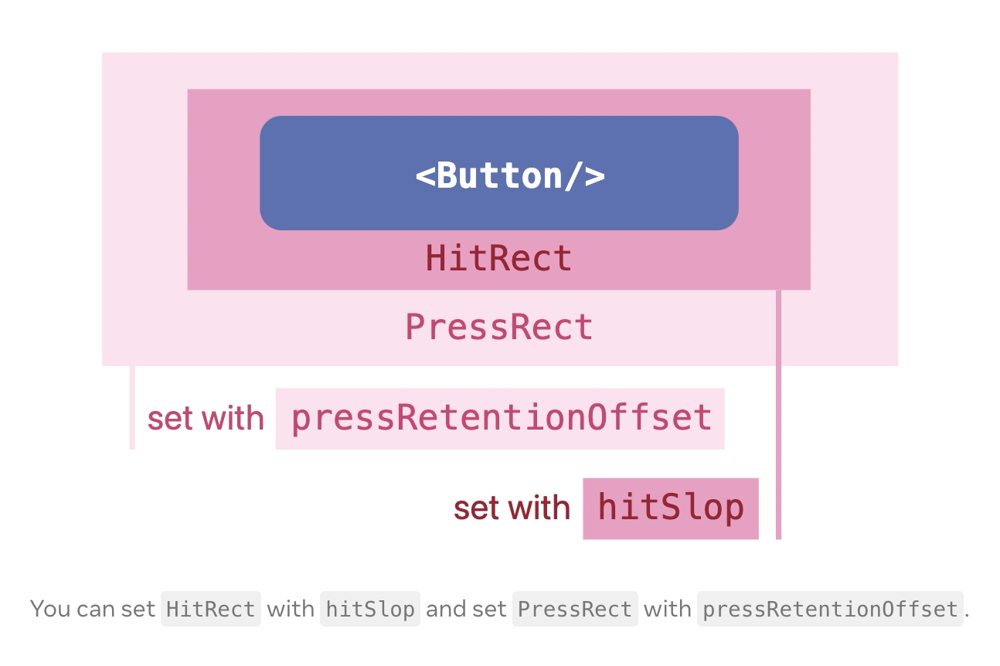

# Pressable 组件

## 概述

+ 第三代 Pressable 点按组件，不再是 Touchable 组件的封装，而是一个全新重构的点按组件，它的反馈效果可由开发者自行配置

+ Pressable 是一个核心组件的封装，它可以检测到任意子组件的不同阶段的按压交互情况

  ```html
  <Pressable onPress={onPressFunction}>
    <Text>I'm pressable!</Text>
  </Pressable>
  ```

## 事件

+ 在被 Pressable 包装的元素上：

  + onPressIn 在按压时被调用
  + onPressOut 在按压动作结束后被调用

+ 在按下 onPressIn 后，将会出现如下两种情况的一种：

  + 用户移开手指，依次触发 onPressOut 和 onPress 事件
  + 按压持续 500 毫秒以上，触发 onLongPress 事件。(onPressOut 在移开手后依旧会触发。)

  

  ```js
  import React from "react";
  import { Pressable, StyleSheet, Text, View } from "react-native";

  const App = () => {
    function onPressHandle() {
      console.log("onPressHandle");
    }

    function onPressOutHandle() {
      console.log("onPressOutHandle");
    }

    function onPressInHandle() {
      console.log("onPressInHandle");
    }

    function onLongPressHandle() {
      console.log("onLongPressHandle");
    }

    return (
      <View style={styles.container}>
        <Pressable
          onPress={onPressHandle}
          onPressIn={onPressInHandle}
          onPressOut={onPressOutHandle}
          onLongPress={onLongPressHandle}
        >
          <Text style={{textAlign: 'center'}}>Press Me</Text>
        </Pressable>
      </View>
    );
  };

  const styles = StyleSheet.create({
    container: {
      flex: 1,
      justifyContent: "center",
    },
  });

  export default App;
  ```

## 点按 与 按住不放

+ 轻点按钮时，会依次触发 PressIn、Press、PressOut
+ 按住不放，则是先触发 PressIn，500ms 后触发 LongPress，松开之后触发 PressOut

## 点按自定义样式

+ 关于点按时的样式，也是可以自定义的

  ```js
  import React from "react";
  import { Pressable, StyleSheet, Text, View } from "react-native";

  const App = () => {
    return (
      <View style={styles.container}>
        <Pressable
          style={({ pressed }) => {
            if (pressed) {
              return styles.pressdStyle;
            } else {
              return styles.unPressdStyle;
            }
          }}
        >
          {({ pressed }) => {
            // 根据是否点按返回不同的子组件
            if (pressed) {
              return (
                <Text
                  style={{ textAlign: "center", color: "white", lineHeight: 100 }}
                >
                  Pressd
                </Text>
              );
            } else {
              return (
                <Text style={{ textAlign: "center", color: "white" }}>
                  Press Me
                </Text>
              );
            }
          }}
        </Pressable>
      </View>
    );
  };

  const styles = StyleSheet.create({
    container: {
      flex: 1,
      justifyContent: "center",
    },
    pressdStyle: {
      backgroundColor: "rgb(210, 230, 255)",
      height: 100,
      lineHeight: "100",
    },
    unPressdStyle: {
      backgroundColor: "#ccc",
    },
  });

  export default App;
  ```

## Pressable 组件可触发区域 HitRect

+ Pressable 组件有一个可触发区域 HitRect，默认情况下，可触发区域 HitRect 就是盒模型中的不透明的可见区域
+ 你可以通过修改 hitSlop 的值，直接扩大可触发区域

  ```html
  <!-- 增加了 Pressable 组件的可点击区域，并且明确指定了 4 个边各自扩充多少 -->
  <Pressable
    hitSlop={{ top: 20, bottom: 20, left: 20, right: 20 }}
  >
      ...
  </Pressable>
  ```

+ 在老点不中、老勾不中的场景中，你可以在不改变布局的前提下，设置 Pressable 组件的可触发区域 HitSlop，让可点击区域多个 10 像素、20 像素，让用户的更容易点中

## 可保留区域 PressRect

+ 在 Pressable 组件中还有一个可保留区域 PressRect 的概念

+ 点按事件可保留区域的偏移量（Press Retention Offset）默认是 0，也就是说默认情况下可见区域就是可保留区域
+ 你可以通过设置 pressRetentionOffset 属性，来扩大可保留区域 PressRect

  + 举一个例子，当你在购物 App 点击购买按钮时，你已经点到购买按钮了，突然犹豫，开始进行心理博弈，想点又不想点。手指从按钮上挪开了，又挪了进去，然后又挪开了，如此反复。这时还要不要触发点击事件呢？要不要触发，其实是根据你手指松开的位置来判断的，如果你松手的位置在可保留区域内那就要触发，如果不是那就不触发

  

## 示例

+ 示例

  ```js
  import React, { useState } from "react";
  import { Pressable, StyleSheet, Text, View } from "react-native";

  const App = () => {
    const [timesPressed, setTimesPressed] = useState(0);

    let textLog = "";
    if (timesPressed > 1) {
      textLog = timesPressed + "x onPress";
    } else if (timesPressed > 0) {
      textLog = "onPress";
    }

    return (
      <View style={styles.container}>
        <Pressable
          onPress={() => {
            setTimesPressed((current) => current + 1);
          }}
          style={({ pressed }) => [
            {
              backgroundColor: pressed ? "rgb(210, 230, 255)" : "white",
            },
            styles.wrapperCustom,
          ]}
        >
          {({ pressed }) => (
            <Text style={styles.text}>{pressed ? "Pressed!" : "Press Me"}</Text>
          )}
        </Pressable>
        <View style={styles.logBox}>
          <Text testID="pressable_press_console">{textLog}</Text>
        </View>
      </View>
    );
  };

  const styles = StyleSheet.create({
    container: {
      flex: 1,
      justifyContent: "center",
    },
    text: {
      fontSize: 16,
    },
    wrapperCustom: {
      borderRadius: 8,
      padding: 6,
    },
    logBox: {
      padding: 20,
      margin: 10,
      borderWidth: StyleSheet.hairlineWidth,
      borderColor: "#f0f0f0",
      backgroundColor: "#f9f9f9",
    },
  });

  export default App;
  ```

