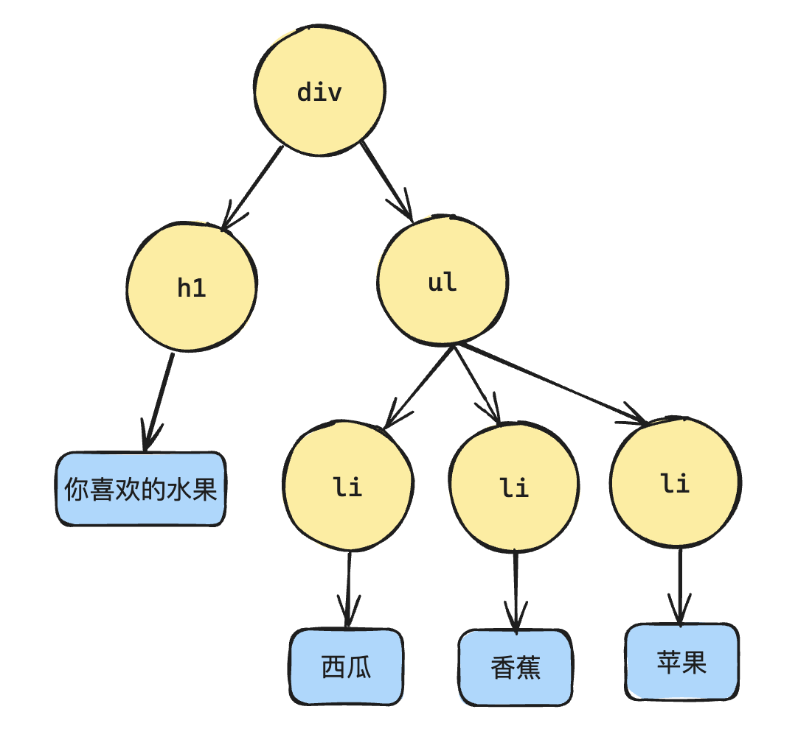

# 组件树和虚拟DOM树

## 定义

+ 组件树：指的是一个一个组件所形成的树结构
+ 虚拟 DOM 树：指的是某一个组件内部的虚拟 DOM 数据结构，并非整个应用的虚拟 DOM 结构

## DOM 树

+ 在最早期的时候，大家接触到的树就是 DOM 树

  ```html
  <div>
    <h1>你喜欢的水果</h1>
    <ul>
      <li>西瓜</li>
      <li>香蕉</li>
      <li>苹果</li>
    </ul>
  </div>
  ```

+ 上面的 HTML 结构就会形成一个 DOM 树结构

  

## 组件

+ 实际上，组件的本质就是对一组 DOM 进行复用。

+ 假设我们将上面的 DOM 结构封装成一个组件 Fruit，该组件就可以用到其他的组件里面，组件和组件之间就形成了树结构，这就是组件树
+ 而每个组件的背后，对应的是一组虚拟 DOM，虚拟 DOM 的背后又是真实 DOM 的映射：

  

## 为什么 Vue 中既有响应式，又有虚拟 DOM 以及 diff 算法

+ 回顾 Vue1.x 以及 Vue2.x 的响应式

  + Object.defineProperty
  + Dep：相当于观察者模式中的发布者
  + Watcher：相当于观察者模式中的观察者

## Vue1.x

+ 在 Vue1.x 的时候没有虚拟 DOM，模板中每次引用一个响应式数据，就会生成一个 watcher

  ```html
  <template>
    <div class="wrapper">
      <!-- 模版中每引用一次响应式数据，就会生成一个 watcher -->
      <!-- watcher 1 -->
      <div class="msg1">{{ msg }}</div>
      <!-- watcher 2 -->
      <div class="msg2">{{ msg }}</div>
    </div>
  </template>

  <script>
  export default {
    data() {
      return {
        // 和 dep 一一对应，和 watcher 一 对 多
        msg: 'Hello Vue 1.0'
      }
    }
  }
  </script>
  ```

+ 优点：这种设计的好处在于能够精准的知道哪个数据发生了变化。
+ 缺点：当应用足够复杂的时候，一个应用里面会包含大量的组件，而这种设计又会导致一个组件对应多个 watcher，这样的设计是非常消耗资源的

  

##  Vue2.0

+ 于是从 Vue2.0 版本开始，引入了虚拟 DOM
+ 2.0 的响应式有一个非常大的变动，将 watcher 的粒度放大到了组件级别，也就是说，一个组件对应一个 watcher
+ 但是这种设计也会带来一些新的问题：以前能够精准的知道是哪一个节点要更新，但是现在因为 watcher 是组件级别，只能知道是哪个组件要更新，但是组件内部具体是哪一个节点更新是无从得知的
+ 这个时候虚拟 DOM 就派上用场了，通过对虚拟 DOM 进行 diff 计算，就能够知道组件内部具体是哪一个节点更新

  

##  Vue3.0

Vue3 的响应式在架构层面上面是没有改变的，仍然是响应式+虚拟DOM

  + 响应式：精确到组件级别，能够知道哪一个组件更新了。不过 Vue3 的响应式基于 Proxy
  + 虚拟 DOM：通过 diff 算法计算哪一个节点需要更新，不过 diff 算法也不再是 Vue2 的 diff 算法，算法方面也有更新
