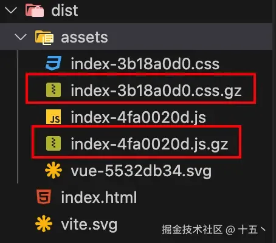

# gzip 压缩打包

## 概述

+ GitHub 地址：vite-plugin-compression

+ 安装 vite-plugin-compression

  ```bash
  pnpm add vite-plugin-compression -D
  ```

  ```js
  //vite.config.ts
  import viteCompression from "vite-plugin-compression";

  export default defineConfig({
    plugins: [
      vue(),
      //默认压缩gzip，生产.gz文件
      viteCompression({
        deleteOriginFile: false, //压缩后是否删除源文件
      }),
    ],
  });
  ```

+ 运行 pnpm build 命令，查看 dist 的 assets 目录：

  

+ 一般来说，真正想使用 gzip 压缩来优化项目，还需要在 nginx 中开启 gzip 并进行相关配置，这一步交给后端来处理


