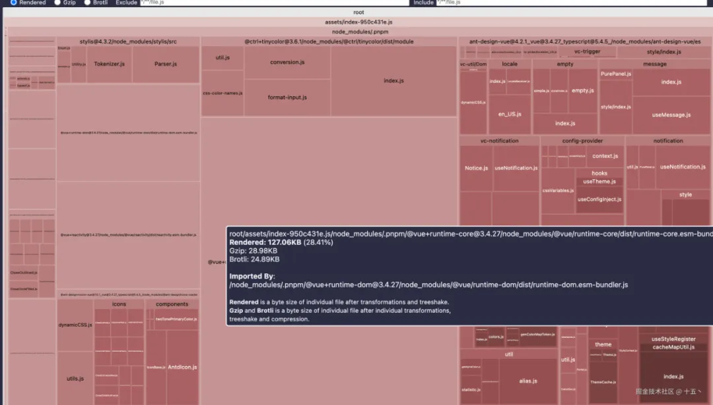

# 打包分析可视化

## 概述

+ GitHub 地址：rollup-plugin-visualize

+ 安装 rollup-plugin-visualizer

  ```bash
  pnpm add rollup-plugin-visualizer -D
  ```

  ```js
  import { defineConfig } from "vite";
  import vue from "@vitejs/plugin-vue";
  import { visualizer } from "rollup-plugin-visualizer";

  // https://vitejs.dev/config/
  export default defineConfig({
    plugins: [
      vue(),
      visualizer({
        open: true, //build后，是否自动打开分析页面，默认false
        gzipSize: true, //是否分析gzip大小
        brotliSize: true, //是否分析brotli大小
        //filename: 'stats.html'//分析文件命名
      }),
    ],
  });
  ```

+ 使用命令 pnpm build 后，分析图 html 文件会在根目录下生成，默认命名为 stats.html


  

+ 把分析文件加入 .gitignore ，不提交到 git 仓库中

  ```js
  stats.html
  ```


