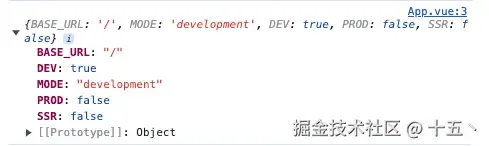

# 基础配置

## 概述

+ 环境变量。顾名思义，在不同环境下呈现不同的变量值

+ Vite 在一个特殊的  `import.meta.env`  对象上暴露环境变量，这些变量在构建时会被静态地替换掉。这里有一些在所有情况下都可以使用的内建变量：

  + `import.meta.env.MODE`: {string} 应用运行的模式
  + `import.meta.env.BASE_URL`: {string} 部署应用时的基本 URL。他由base  配置项决定
  + `import.meta.env.PROD`: {boolean} 应用是否运行在生产环境（使用  NODE_ENV='production'  运行开发服务器或构建应用时使用  NODE_ENV='production' ）
  + `import.meta.env.DEV`: {boolean} 应用是否运行在开发环境 (永远与  `import.meta.env.PROD` 相反)
  + `import.meta.env.SSR`: {boolean} 应用是否运行在  server  上

+ 也可以打印 import.meta.env 对象查看拥有的属性

  

  + BASE_URL：应用程序的基本 URL 路径，默认为 /
  + DEV：当前是否处于开发模式，在生产环境，这个值为 false
  + MODE：当前的运行模式，development 表示开发模式，生产环境，是 production
  + prod：与 DEV 相反，表示是否处于生产模式，在生产环境，这个值是 true
  + SSR：当前是否运行在服务器端渲染环境，如果使用 SSR，服务器端运行时这个值是 true
