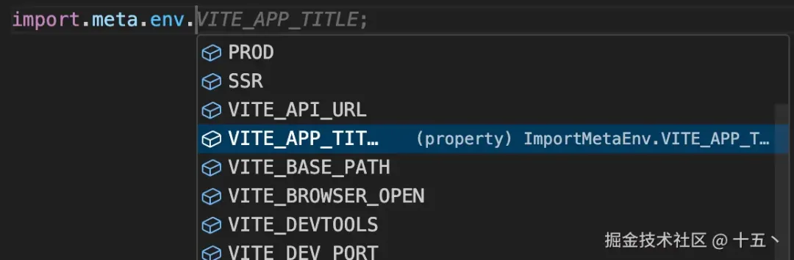

# TS 智能提示

## 概述

+ 果项目中用上了 TS，那么可以为环境变量提供智能提示，详见官方文档

+ 在 src/typings 目录下新建一个 env.d.ts，写入以下内容

  ```js
  //环境变量-类型提示
  interface ImportMetaEnv {
    /** 全局标题 */
    readonly VITE_APP_TITLE: string;
    /** 本地开发-端口号 */
    readonly VITE_DEV_PORT: number;
    //加入更多环境变量...
    }

  interface ImportMeta {
      readonly env: ImportMetaEnv
  }
  ```

+ 即可得到类型提示，鼠标停留在变量上也会显示注释

  

+ 记得在 tsconfig 文件中配置 include 引入类型声明文件，typings 代表你的类型文件目录名称

  ```js
  {
    // "compilerOptions": {},
    "include": ["typings/**/*.d.ts","typings/**/*.ts"]
  }
  ```


