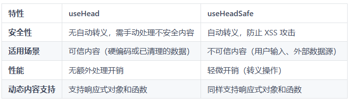

## 组合式函数

## useHead

+ 配置的形式往往都是写死的，并且所有页面通用的。无法使用响应式数据，Nuxt 中提供了组合式函数 useHead 来为 meta 信息提供响应式的修改。相比配置文件的形式，useHead 的优势在于：

  + 动态修改 <head>：在不同的页面或者组件中可以设置不同的 title、meta 信息
  + 支持响应式数据
  + 避免全局污染

  ```html
  <script setup lang="ts">
  useHead({
    title: "用户管理系统",
    meta: [
      { name: 'description', content: '这是一个 Nuxt3 网站' }
    ],
    bodyAttrs: {
      class: 'test'
    },
    script: [ { innerHTML: 'console.log(\'Hello world\')' } ]
  })
  </script>
  ```

## useHeadSafe 推荐

+ 除了 useHead 以外，还有一个 useHeadSafe：

  + 对输入内容进行 HTML 转义，防止恶意脚本注入。
  + 适用于不可信内容（如用户输入、外部 API 返回的数据等）。
  + 通过转义特殊字符（如 <, >, &），确保内容以纯文本形式显示，而非可执行代码。

  ```js
  const userInput = '<script>alert("恶意代码")</script>';
  useHeadSafe({
    title: ()=>userInput
  })
  ```

## useHead与useHeadSafe

+ 两者的对比如下：

  

+ 因此在使用时建议优先使用 useHeadSafe，特别是当内容来自用户输入、URL 参数、数据库或第三方 API 时，始终使用 useHeadSafe
+ 在内容完全可信（如静态字符串）时可以使用 useHead，使用时避免直接插入未经验证的动态内容

## useSeoHead

+ 除了 head 相关的组合式函数以外，Nuxt 中还提供了一个专门处理 meta 的组合式函数 useSeoHead
+ 虽然 useHead 也能够设置 meta 信息，例如

  ```js
  useHead({
    title: '我的页面标题', // 设置标题
    script: [{ src: '/analytics.js' }], // 插入脚本
    link: [{ rel: 'icon', href: '/favicon.ico' }] // 插入链接
    meta: [
      { name: 'description', content: '页面描述' }, // 普通 meta 标签
      { property: 'og:title', content: 'Open Graph 标题' }, // Open Graph 标签
      { name: 'twitter:card', content: 'summary_large_image' } // Twitter 卡片标签
    ]
  });
  ```

+ 不过使用 useSeoHead 能够简化常见 SEO 属性的配置，useSeoHead 具备如下特点：

  + 语义化语法：通过更直观的键值对（如 ogTitle 代替 property: 'og:title'）配置标签
  + 自动推导：自动将驼峰式键名转换为 SEO 标准的属性名（如 ogTitle → og:title）
  + 类型安全：提供 TypeScript 类型提示，减少拼写错误
  + 内置安全性：默认对动态内容进行转义，防止 XSS 攻击（类似 useHeadSafe 的行为）
  + 仅支持 SEO 相关标签：无法操作 `<script>` 、 `<link>` 等非 SEO 标签

  ```js
  useSeoMeta({
    title: '我的页面标题', // 自动设置 <title> 和 og:title
    description: '页面描述', // 自动设置 description 和 og:description
    ogTitle: 'Open Graph 标题', // 自动转换为 property="og:title"
    twitterCard: 'summary_large_image', // 自动转换为 name="twitter:card"
    ogImage: 'https://example.com/image.jpg' // 自动处理为 og:image
  });
  ```
useHead与useSeoMeta