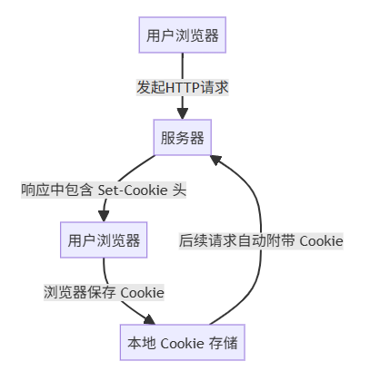

# useCookie

## 概述

+ Cookie 的工作原理

  1. 浏览器向服务器发送请求
  2. 服务器进行响应，并且在响应头里面通过 Set-Cookie 来指示浏览器保存或者更新 Cookie
  3. 浏览器保存最新的 Cookie
  4. 后续请求带上这个 Cookie

  

## document.cookie

+ 以前前端开发中要操作 Cookie 通过 document.cookie 接口进行操作。

+ 读取Cookie:document.cookie 返回的是一个字符串，包含当前页面所有的 Cookie，每个 Cookie 之间用分号和空格分隔。你需要对这个字符串自行分割和解析。

  ```
  "name=value; expires=DATE; path=PATH; domain=DOMAIN; sameSite=VALUE"
  ```

+ 更新 Cookie:通过重新赋值新的字符串给 document.cookie 可以设置新的 Cookie 值。

+ 删除 Cookie:删除 Cookie 通常是将 Cookie 的过期时间设置为一个过去的时间。

  + 思考一下🤔 SSR 场景下操作 Cookie 会遇到什么问题？

## useCookie

+ 在 SSR 环境下，并没有浏览器的 DOM 对象，因此也就不存在 document.cookie
+ Nuxt 为我们提供了 useCookie 的组合式函数来做 Cookie 的处理

+ useCookie 的基本用法：

  + 读取 Cookie

  ```js
  const token = useCookie('token')
  token.value
  ```

+ 更新 Cookie

  ```js
  const token = useCookie('token')
  token.value = 'new_token'
  ```

+ 删除 Cookie

  ```js
  const token = useCookie('token')
  token.value = null
  ```

+ useCookie 函数接受第二个参数 options，用于配置 Cookie 的行为。常见的配置选项包括：

  + maxAge：设置 Cookie 的有效期（单位：秒）。例如，设置 7 天有效期
  + expires：直接指定一个 Date 对象，作为 Cookie 的过期时间。
  + httpOnly：若设为 true，则 Cookie 只能在服务端访问，不可通过客户端 JavaScript 操作。
  + secure：若设为 true，则 Cookie 只能通过 HTTPS 传输。
  + domain 和 path：分别指定 Cookie 的适用域名和路径。
  + sameSite：控制 Cookie 的同站策略。

+ 例如，我们可以这样设置一个 Cookie 用于存储用户信息：

  ```html
  <script setup lang="ts">
  const userInfo = useCookie('userInfo', {
    maxAge: 60 * 60 * 24 * 30, // 30 天有效期
    path: '/',
    secure: true,
    httpOnly: true,
    sameSite: 'lax'
  })
  // 设置默认值或更新Cookie
  userInfo.value = { username: 'Alice', score: 100 }
  </script>
  ```

## 对比

+ 相较于原生的 document.cookie，有如下的优点：

  + 该组合式函数更加的简洁，不需要去拆分和组合字符串。
  + 返回的是响应式数据，值的变化会自动触发视图更新。
  + 对 SSR 友好，这意味着在服务端渲染期间也能正确读取和写入 Cookie。无论是在服务器首次渲染页面，还是在客户端水合后继续操作 Cookie，useCookie 都能保持一致的状态。
