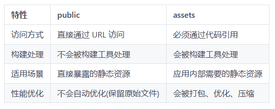

# public与assets

## 概述

+ 静态资源的目录有两个

  + 一个是 `public`
  + 一个是 `assets`

## public

+ public 目录下的文件会原封不动地复制到最终生成的 dist 文件夹中，路径不会被 webpack 或 vite 等处理
+ 可以通过 `/` 开头的绝对路径直接访问

+ 例如 `public/logo.png` 可通过 `/logo.png` 访问

+ 因此 public 适合存放不需要经过构建工具处理的资源，例如：

  + 静态图像(如图标、Logo)
  + .txt 文件(如 robots.txt)

## assets

+ assets 目录下的文件会被 webpack 或 vite 等构建工具，通常会被打包、压缩、优化，并可能被重命名(带有 hash 值)
+ 因此 assets 下的资源通常是在应用中通过 `@/assets` 引入，例如：

  + 样式文件(.css、.scss 等)
  + 图标文件
  + 图像文件(如需要通过 `@import` 或 `url( )` 引用的图片)
  + 使用工具链需要处理的资源(如优化后的 svg)

## public与assets对比

+ public与assets对比

  
