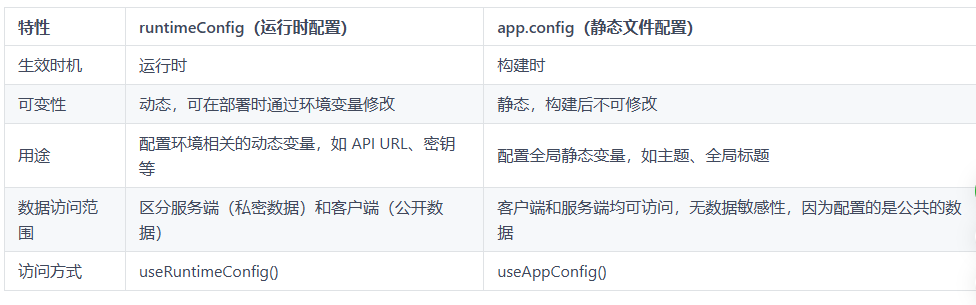

# 静态配置与运行时配置

## 概述

+ 静态配置文件
+ 运行时配置文件

## 静态配置文件

+ 在项目根目录下的创建一个 app.config.ts 文件，作为静态配置文件。

+ 该文件内可以放置在构建时就已确定的、对整个应用程序都公开且需要在客户端和服务端均可访问的公共数据。

+ 静态配置文件的特点如下：

  + 构建时生效：配置的这些值在构建时就被确定下来了
  + 全局配置：配置的是一些全局的信息。例如主题、标题、布局之类的信息

  ```js
  export default defineAppConfig({
    title: "Hello Nuxt",
    theme: {
      dark: true,
      colors: {
        primary: "#ff0000",
      },
    },
    foo: "bar",
  });
  ```

+ 组件中引入这些全局变量：

  ```html
  <script setup>
  const appConfig = useAppConfig();
  console.log(appConfig.title);
  console.log(appConfig.theme);
  console.log(appConfig.foo);
  </script>
  ```

+ updateAppConfig 是 Nuxt 提供的一个工具方法，可用于在更新 app.config.ts 中的配置信息。

  ```html
  <script setup>
  const appConfig = useAppConfig() // { foo: 'bar' }
  const newAppConfig = { foo: 'baz' }
  updateAppConfig(newAppConfig)
  console.log(appConfig) // { foo: 'baz' }
  </script>
  ```

+ 思考🤔：app.config.ts是静态配置文件，值在构建时被确定，运行时不可更改。那为什么updateAppConfig可以修改？

  + app.config.ts 里面所配置的值是初始的公共值，在构建的时候确实会被固定下来，但是 Nuxt 会将这些静态值包装成一个响应式数据，在应用中调用 useAppConfig 拿到的是这个响应式对象，updateAppConfig 方法修改的也是这个响应式对象
  + 因此，updateAppConfig修改的仅仅是运行时的那个响应式对象，不会影响 app.config.ts 文件

## 运行时配置

+ 运行时配置 runtimeConfig，在 nuxt.config.ts 配置文件中进行配置，并且和 app.config 类似，可以在组件中获取到该配置。

  ```js
  export default defineNuxtConfig({
    runtimeConfig: {
      // 客户端可访问的公共配置（会被编译到前端代码）
      public: {
        apiBase: '/api'
      },
      // 私有配置（仅服务器端访问，可通过环境变量覆盖）
      apiSecret: 'default_value' // 会被 process.env.NUXT_API_SECRET 覆盖
    }
  })
  ```

+ 通过环境变量（部署运行时）：

  ```
  # 部署后设置环境变量
  NUXT_API_SECRET=your_secret_value node .output/server/index.mjs
  ```

+ 服务端和客户端通过 useRuntimeConfig() 获取配置信息。

  ```js
  const config = useRuntimeConfig();
  console.log(config.apiSecret); // 服务端：正常输出，客户端：undefined
  console.log(config.public.apiBase); // 服务端和客户端都可用
  ```

+ 运行时配置适合配置比较敏感的信息，例如 API 基础 URL、密钥等。这些配置信息通常会受到环境变量的影响，可以在运行时根据部署环境进行动态调整。

+ 运行时配置特点如下：

  + 运行时可变:通过环境变量可以修改运行时配置的值
  + 区分客户端和服务端
  + 适合敏感数据

## 和 app.config 对比

+ 如下表：

  

## 最佳实践

+ 如果你的数据依赖于环境变量或部署环境，比如动态 API 地址、密钥等，那么推荐将这些数据写在 runtimeConfig 里面

+ 如果你的数据是全局的、静态的，且不会因环境变化而修改，比如应用主题或构建时的静态配置，那么推荐写在 app.config 里面。

+ 例如：

  ```js
  // nuxt.config.ts
  export default defineNuxtConfig({
    // 动态调整 API 基础路径。
    runtimeConfig: {
      public: {
        apiBase: process.env.API_BASE || 'https://default.api.com',
      },
    },
  });
  ```

  ```js
  // app.config.ts
  export default defineAppConfig({
    // 定义应用的全局主题颜色，在运行时保持一致。
    theme: {
      primaryColor: '#4caf50',
    },
  });
  ```
