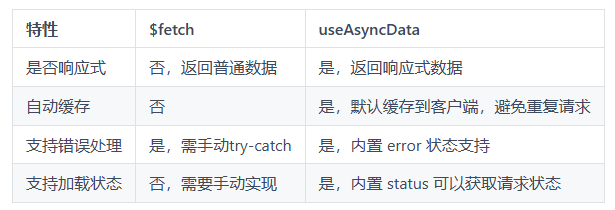

# useAsyncData

## 概述

+ 如果想要避免重复请求的情况，可以使用 useAsyncData，这是一个 Nuxt 内置的组合式函数，数据仅在服务器端请求一次，然后会有缓存，可以有效避免客户端的重复请求

+ 在初始 SSR 的时候，useAsyncData 会在服务器等待数据获取完成后再渲染页面
+ 这样服务器生成的 html 是包含数据的，但是这也意味着服务器端在渲染首屏 html 的时候需要等待请求的时间

+ 基础语法如下：

  ```html
  <script setup lang="ts">
  const { data, status, error, refresh, clear } = await useAsyncData(
    'mountains',
    () => $fetch('https://api.nuxtjs.dev/mountains')
  )
  </script>
  ```

## API

+ 定义

  ```js
  function useAsyncData<DataT, DataE>(
    handler: (nuxtApp?: NuxtApp) => Promise<DataT>,
    options?: AsyncDataOptions<DataT>
  ): AsyncData<DataT, DataE>

  function useAsyncData<DataT, DataE>(
    key: string | Ref<string> | ComputedRef<string>,
    handler: (nuxtApp?: NuxtApp) => Promise<DataT>,
    options?: AsyncDataOptions<DataT>
  ): Promise<AsyncData<DataT, DataE>>
  ```

  ```js
  // 两个主要区别就是一个没有key,一个有key
  // 可选参数的类型定义
  type AsyncDataOptions<DataT> = {
    server?: boolean
    lazy?: boolean
    immediate?: boolean
    deep?: boolean
    dedupe?: 'cancel' | 'defer'
    default?: () => DataT | Ref<DataT> | null
    transform?: (input: DataT) => DataT | Promise<DataT>
    pick?: string[]
    watch?: WatchSource[] | false
    getCachedData?: (key: string, nuxtApp: NuxtApp, ctx: AsyncDataRequestContext) => DataT | undefined
  }

  type AsyncDataRequestContext = {
    /** The reason for this data request */
    cause: 'initial' | 'refresh:manual' | 'refresh:hook' | 'watch'
  }
  ```

+ 参数：

  + key： 【可选】 为 useAsyncData 提供一个唯一标识符

    + Nuxt 根据提供的 key 检查是否已有缓存
    + 如果缓存存在且有效，直接返回缓存数据
    + 如果没有缓存或缓存失效，则调用 fetcher 函数获取数据

  + fetcher 函数：定义如何获取数据

  + options 可选

    + lazy: 是否在页面加载之后再等待执行异步任务，默认为false，表示在页面加载之前会阻塞，直到异步任务执行完

      + 如果 lazy 项设置为 `true` ，这意味着导航不会等待数据获取完成，页面会立即渲染，数据获取在后台进行

    + default: 一个工厂方法, 在异步任务还未执行完时，生成一个默认的返回的数据,
    + server: 默认为true, 表示是会在服务器去执行异步任务获取数据
    + pick: 数组类型，表示只从异步任务返回数据之前，选择指定的数据返回

      + 例如:

        ```js
        // 接口实际返回的数据 {"title":"dkdkkd", "description":"dkjskdjs", "other":"dksjdksj"}
        const { data: mountain } = await useFetch('/api/mountains/everest', { pick: ['title', 'description'] })
        ```

    ```html
    <template>
      <div>App page</div>
    </template>
    <script setup>
    const { data } = await useAsyncData("userList", () =>
      $fetch("http://localhost:7001/users")
    );
    console.log(data.value);
    </script>
    ```

+ 返回值

  ```js
  // 返回数据类型定义
  type AsyncDataRequestContext = {
    /** The reason for this data request */
    cause: 'initial' | 'refresh:manual' | 'refresh:hook' | 'watch'
  }

  interface AsyncDataExecuteOptions {
    dedupe?: 'cancel' | 'defer'
  }

  type AsyncDataRequestStatus = 'idle' | 'pending' | 'success' | 'error'

  type AsyncData<DataT, ErrorT> = {
    data: Ref<DataT | null>
    refresh: (opts?: AsyncDataExecuteOptions) => Promise<void>
    execute: (opts?: AsyncDataExecuteOptions) => Promise<void>
    clear: () => void
    error: Ref<ErrorT | null>
    status: Ref<AsyncDataRequestStatus>
  };
  ```

  data: 异步任务返回的数据

    + 存储异步数据请求的结果，并且这是一个响应式数据

    + 服务端在返回这个data的同时，会将data数据序列化并存放在payload里，payload和已经 渲染好的html文本一起发送给浏览器
    + 在客户端(浏览器)第一次加载页面执行这个方法的时候，并不会真正的等待执行异步任务，而是先检查payload中是否已经存在此数据，如果存在则直接返回payload中的数据。这样客户端不用再次请求接口，而是直接拿到服务端已经请求过的数据
    + 然后在客户端切换路由过程中再次加载此页面时，会等待执行异步任务，此时data里是最新的数据

  + status

    + idle：当请求尚未启动时，例如：
      + when 尚未调用并设置execute{ immediate: false }
      + 在服务器上渲染 HTML 时，并且已设置{ server: false }
    + pending：请求正在进行中
    + success：请求已成功完成
    + error：请求失败

  + refresh/execute: 此返回值是一个函数对象，调用时会两次执行handler中的异步任务并更新data中的数据

## $fetch 与 useAsyncData

+ `$fetch`: 方法灵活性高，可以在任何地方使用
+ `useAsyncData`: 为服务端渲染（SSR）或组件挂载之前的数据获取场景设计，返回响应式数据以及一系列工具函数

  

  + 如果是在组件已经挂载后使用，Nuxt 会给出一个警告：`Component is already mounted, please use $fetch instead.`

+ 整体来讲，useAsyncData 相比 $fetch 更加方便

## 示例1

+ 场景示例：从一个 API 获取文章数据并渲染到页面上，同时支持以下功能：

  + 显示加载状态
  + 数据请求完成后展示文章列表
  + 在点击按钮时刷新数据

+ $fetch示例代码

  ```html
  <template>
    <div>
      <button @click="fetchPosts" :disabled="loading">刷新数据</button>
      <div v-if="loading">加载中...</div>
      <ul v-else>
        <li v-for="post in posts" :key="post.id">{{ post.title }}</li>
      </ul>
    </div>
  </template>

  <script setup>
  const posts = ref([]) // 存储文章列表
  const loading = ref(false); // 加载的状态

  const fetchPosts = async ()=>{
    loading.value = true;
    try{
      posts.value = await $fetch('/api/posts');
    } finally {
      loading.value = false;
    }
  }
  fetchPosts();
  </script>
  ```

+ useAsyncData示例代码

  ```html
  <template>
    <div>
      <button @click="refresh" :disabled='pending'>刷新数据</button>
      <div v-if="pending">加载中...</div>
      <ul v-else>
        <li v-for="post in posts" :key="post.id">{{ post.title }}</li>
      </ul>
    </div>
  </template>

  <script setup>
  const { data: posts, pending, refresh} = await useAsyncData('posts', ()=>$fetch('/api/posts'));
  </script>
  ```

## 示例2

+ 同时请求多个数据

  ```js
  const { data: discounts, status } = await useAsyncData('cart-discount', async () => {
    const [coupons, offers] = await Promise.all([
      $fetch('/cart/coupons'),
      $fetch('/cart/offers')
    ])

    return { coupons, offers }
  })
  ```
