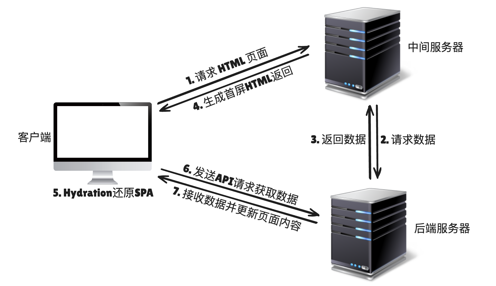

# 应用部署

## 概述

+ 回顾 SSR 工作流程：

  

+ 需要将 Nuxt 应用打包后部署到中间服务器，一般是 Node.js 服务器

## 应用打包

+ 打包

  ```bash
  npm run build
  ```

+ 打包完成后的产物放置于 `.output` 目录里面

+ 可以使用 `npm run preview` 预览打包之后的效果

## 部署到node.js服务器

+ 打包好的 `.outut` 目录，本身就自带 node 服务器，因此不需要再去做搭建 node.js 服务器，将打包产物放置服务器 xxx 目录的操作
+ 可以直接：

  ```bash
  node .output/server/index.mjs
  ```

## 使用pm2部署

+ 部署的时候，一个常见的需求就是进程守护，这里推荐使用 pm2 来做部署

+ 在项目根目录下执行 npx pm2 init simple，这会自动生成 ecosystem.config.js 文件

+ 修改该文件里面的配置：

  ```js
  module.exports = {
    apps: [
      {
        name: "user-system",  // 应用的名称，用于标识 pm2 中的进程的
        script: "./server/index.mjs", // 启动的脚本
        exec_mode: "cluster", // 集群模式，会根据 instances 启动多个进程
                              // 集群模式：cluster
                              // 单进程模式：fork
        instances: "max", // 会根据 CPU 的核心数自动分配实例 ，也可以填写数字
        port: "8888", // 端口号
      },
    ],
  };
  ```

+ 之后使用 npx pm2 start ecosystem.config.js 启动应用

+ 常用命令：

  + `npx pm2 list`
  + `npx pm2 stop all`
  + `npx pm2 stop [id]`
  + `npx pm2 delete all` : 如果修改了配置文件，需要执行此命令

+ 否则应用启动的时候使用的是之前的配置
