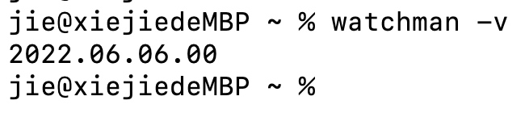
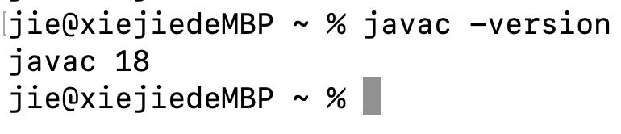
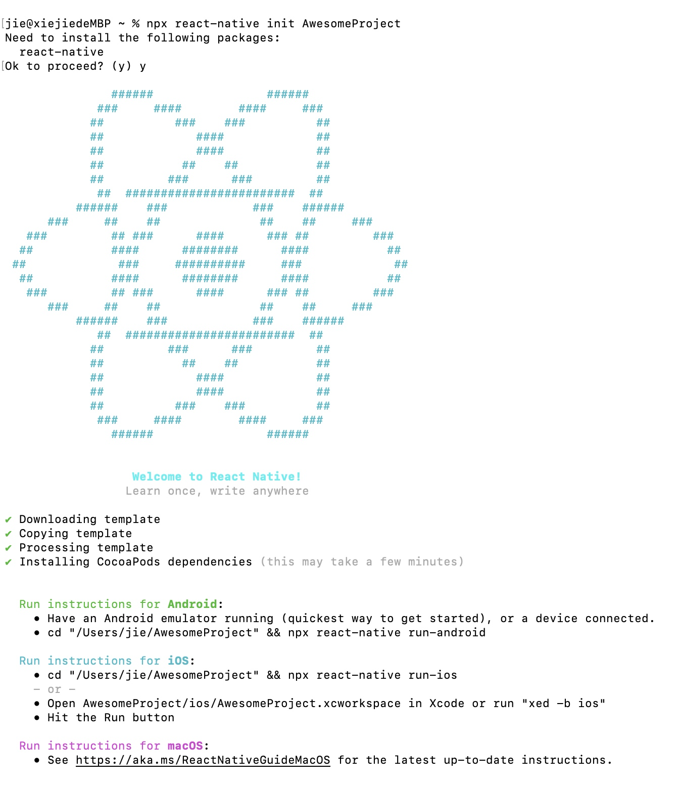
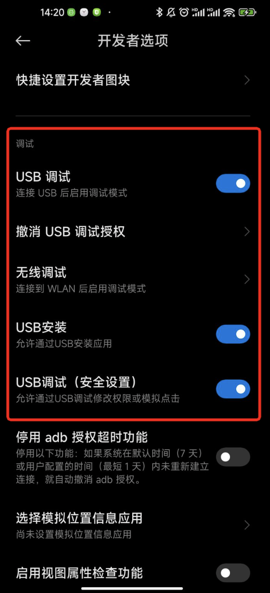
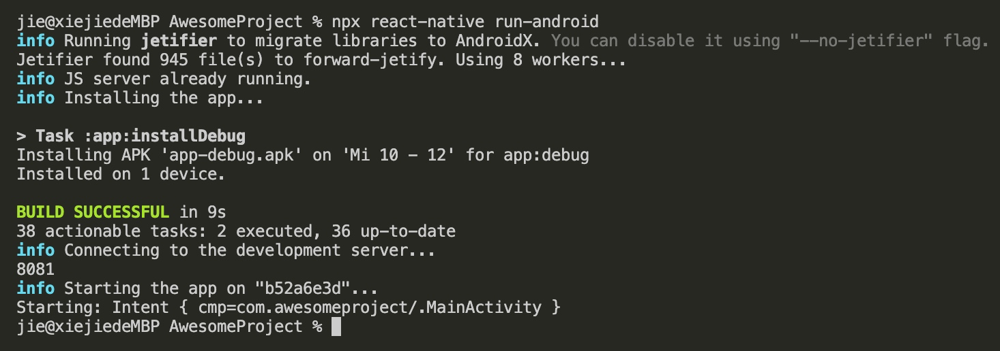
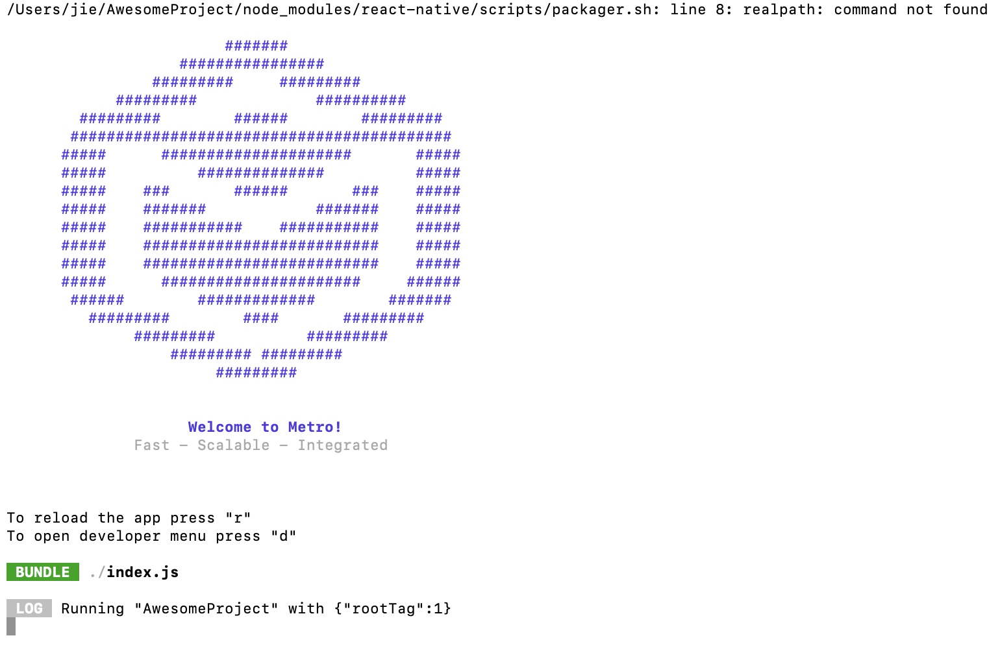
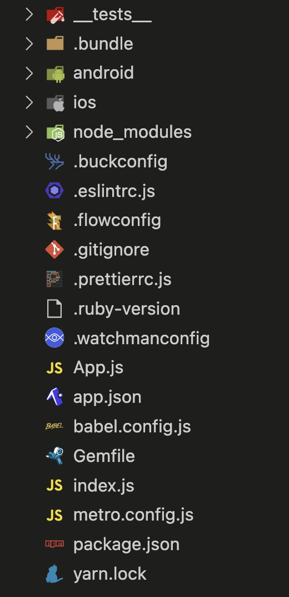

# 通过 React Native CLI 搭建环境

## 概述

+ 整体的依赖有：

  + Node
  + Watchman
  + React Native command line interface
  + JDK
  + Android Studio

## Watchman

+ Watchman 是 Facebook 的一个工具，用于观察文件系统的变化
+ 强烈建议您安装它以获得更好的性能

+ 安装完毕后可以通过 `watchman -v` 命令来查看版本

  

## 安装 JDK

+ 搭建 Android 开发环境需要 Java 环境的支持，因此需要下载和安装操作系统对应的 JDK 版本

+ macOS 安装：https://www.jianshu.com/p/199cd1abd570
+ Windows 安装：https://www.cnblogs.com/maoning/p/10701349.html

+ 最后输入 javac -version 能查看版本号

  

## Android 开发环境

+ 首先下载安装 Andriod Studio

  + 点击官网的下载，可能出现无法下载的情况，将下载地址的 https 协议修改为 http 即可

+ 安装好 Andriod Studio 后，接下来需要安装 Android SDK，根据官网的描述，目前编译 React Native 应用需要的是 Android 11 (R) 版本的 SDK，可以在 Android Studio 的 SDK Manager 中选择安装各版本的 SDK

  

+ 根据官网下方的描述，安装对应的 SDK 工具

  

+ 根据官网的描述，接下来我们需要安装上图中框选的组件，但是第一次是无法选择的，因为没有选择 Android SDK 的 Location，点击右侧的 Edit，先安装一个默认的 Android SDK 版本，目前默认的是 Andriod API 33，展开 Android 11 (R)，勾选上图中框选的组件

  

+ 点击"SDK Tools"选项卡，同样勾中右下角的"Show Package Details"。展开"Android SDK Build-Tools"选项，确保选中了 React Native 所必须的30.0.2版本。你可以同时安装多个其他版本

  

+ 在"SDK Tools"选项卡，点击"NDK (Side by side)"，同样勾中右下角的"Show Package Details"，选择20.1.5948944版本。最后再勾选上"Android SDK Command-line Tools (latest)"

  

+ 最后点击 Apply 来下载安装这些组件

  

+ 接下来需要配置 ANDROID_SDK_ROOT 环境变量

  
  

+ 通过 vi ~/.zshrc 来打开这个配置文件（没有会自动新建），然后按 i 键进入 insert 模式，粘贴上面的配置，然后按 Esc 键退出编辑模式，之后 :wq 保存退出

  

+ 接下来就是让上面的配置生效，按照官网的步骤操作即可：

  

## 创建新项目

+ 通过 npx react-native init <项目名> 来创建新的项目

  

+ 接下来我们需要准备预览环境，你可以准备真机，也可以用模拟器。

+ 真机首先第一步需要开启 USB 调试，不同的机器开启方式不一样

+ 接下来进入【开发者选项】，打开如下的开关

  

+ 接下来执行 npx react-native run-android 命令来启动整个项目

  

+ 此时会启动一个 Metro 服务器，该服务器类似于 webpack 中的 webpack-dev-server，能够实现代码热更新的效果

  

## 目录分析

+ 使用 React Native CLI 所搭建的项目的目录结构

  

+ _test_	React Native工程单元测试文件夹
+ android	原生Android工程文件夹
+ ios	原生iOS工程文件夹
+ node_modules	React Native工程依赖的第三方库
+ index.js	React Native工程入口文件
+ package.json	React Native工程配置文件
