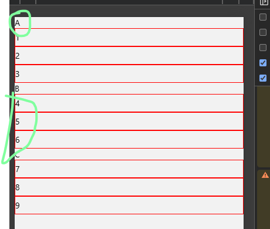

# SectionList

## 概述

+ 和 `FlatList` 一样， `SectionList` 组件也是由 `VirtualizedList` 组件扩展来的
+ 不同于 `FlatList` 组件， `SectionList` 组件主要用于开发列表分组、吸顶悬浮等功能

  

## API

+ SectionList 组件的使用方法也非常简单，只需要提供 renderItem、renderSectionHeader 和 sections 等必要的属性即可

  + sections（必填）：用来渲染的数据，类似于 FlatList 中的 data 属性

  + renderItem（必填）：用来渲染每一个 section 中的每一个列表项的默认渲染器。必须返回一个 react 组件

  + renderSectionHeader：在每个 section 的头部渲染。在 IOS 上，这些 headers 是默认粘接在 ScrollView 的顶部的

  + stickySectionHeadersEnabled ：当 section 把它前一个 section 的可视区推离屏幕时，这个 section 的 header 是否粘连在屏幕顶端

  + `keyExtractor` 和 FlatList 组件一样，表示项目的唯一标识。此函数用于为给定的 item 生成一个不重复的 key

    + Key 的作用是使 react 能够区分同类元素的不同个体，以便在刷新时能够确定其变化的位置，减少重新渲染的开销

    + 若不指定此函数，则默认抽取 item.key 作为 key 值
    + 若 item.key 也不存在，则使用数组下标
    + 注意这只设置了每行（item）的 key，对于每个组（section）仍然需要另外设置 key

+ 官方文档：https://reactnative.dev/docs/sectionlist

  ```js
  <SectionList
    renderItem={({item})=> <ListItem title={item.title}/>}
    renderSectionHeader={({section})=><Header title={section.key}/>}
    sections={[
        {data:[...],title:...},
        {data:[...],title:...},
        {data:[...],title:...},
    ]}
  />
  ```

  ```js
  import React, { useState, useEffect } from "react";
  import {
    View,
    Dimensions,
    Text,
    ActivityIndicator,
    StyleSheet,
    SafeAreaView,
    SectionList,
  } from "react-native";
  import { queryMovies } from "./data/Service";
  import MovieItemCell from "./view/MovieItemCell";

  export const width = Dimensions.get("window").width;
  export const height = Dimensions.get("window").height;

  export default function App() {
    // 初始化电影数据
    const displayingMovies = queryMovies(1, 10);
    const incomingMovies = queryMovies(2, 10);

    // 初始化电影列表和加载状态
    const [sectionData, setSectionData] = useState([]);
    const [loaded, setLoaded] = useState(false);

    useEffect(() => {
      setTimeout(() => {
        setSectionData([
          { title: "正在上映", data: displayingMovies },
          { title: "即将上映", data: incomingMovies },
        ]);
        setLoaded(true);
      }, 1000);
    }, []);

    // 渲染标题
    function renderTitle() {
      return (
        <View style={styles.barStyle}>
          <Text style={styles.txtStyle}>电影列表</Text>
        </View>
      );
    }

    // 渲染加载条
    function renderLoad() {
      if (!loaded) {
        return (
          <View style={styles.container}>
            <ActivityIndicator animating={true} size="small" />
            <Text style={{ color: "#666666", paddingLeft: 10 }}>努力加载中</Text>
          </View>
        );
      }
    }

    function renderItem({item}) {
      return (
        <MovieItemCell
          movie={item}
          onPress={() => {
            alert("点击电影:" + item.title);
          }}
        />
      );
    }

    function renderSectionHeader({ section }) {
      return (
        <View style={styles.sectionHeader}>
          <Text style={styles.sectionTitle}>{section.title}</Text>
        </View>
      );
    }

    // 渲染电影列表
    function renderList() {
      return (
        <SectionList
          keyExtractor={(item) => item.id}
          renderSectionHeader={renderSectionHeader}
          renderItem={renderItem}
          sections={sectionData}
          stickySectionHeadersEnabled={true}
        />
      );
    }

    return (
      <SafeAreaView style={styles.flex}>
        {/* 标题区域 */}
        {renderTitle()}
        {/* 加载条 */}
        {renderLoad()}
        {/* 列表区域 */}
        {renderList()}
      </SafeAreaView>
    );
  }

  const styles = StyleSheet.create({
    flex: {
      flex: 1,
      backgroundColor: "#fff",
    },
    container: {
      flex: 1,
      justifyContent: "center",
      alignItems: "center",
      backgroundColor: "#F5FCFF",
      flexDirection: "row",
    },
    loadingView: {
      flex: 1,
      height: height,
      backgroundColor: "#F5FCFF",
      flexDirection: "row",
      justifyContent: "center",
      alignItems: "center",
      padding: 10,
    },
    barStyle: {
      height: 48,
      width: width,
      justifyContent: "center",
      backgroundColor: "#fff",
    },
    txtStyle: {
      color: "#000",
      textAlign: "center",
      fontSize: 18,
    },
    sectionHeader: {
      padding: 10,
      backgroundColor: "#268dcd",
    },
    sectionTitle: {
      fontSize: 16,
      fontWeight: "bold",
      color: "#fff",
    },
  });
  ```
