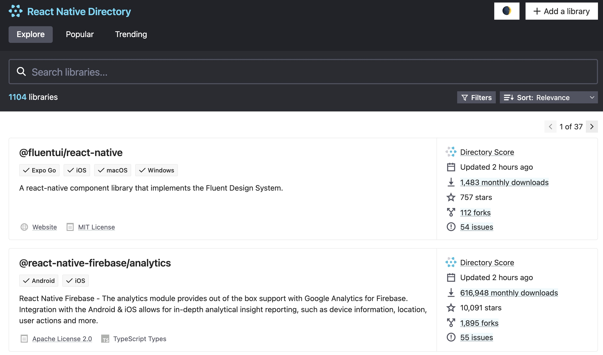
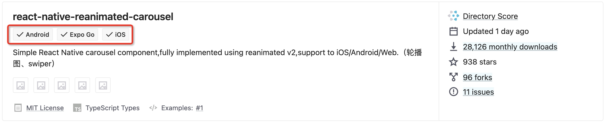
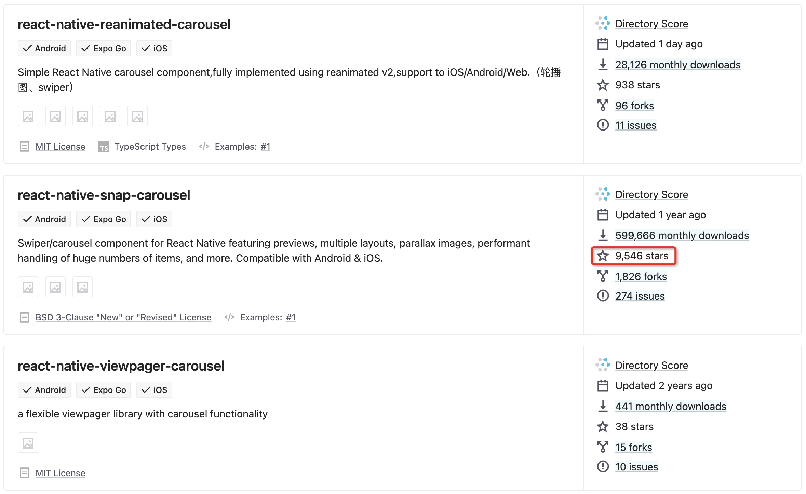

# 基础

## 概述

+ 目前在 RN 中支持的第三方库 https://reactnative.directory/

## 查询

+ 查询

  

+ 每一个第三方库下面会标注所支持的平台以及其他相关信息

  

+ 轮播图为例，首先搜索 carousel，就会出现各种轮播图相关的第三方库

  

+ 选择一个 star 数较高的库，点击进去后，一般是一个 Github 仓库，里面就有作者所记录的该库的具体用法

## 总结

+ 当然，你在网络上也能够找到别人对 RN 第三方库的一些总结性文章，例如：

  + https://zhuanlan.zhihu.com/p/42400628

  + https://www.jianshu.com/p/809f6ee09613

  + https://www.jianshu.com/p/9e1c359e9e93

+ 这里就不再一一赘述，使用第三方库的能力，其实就是考察你查阅文档的能力
