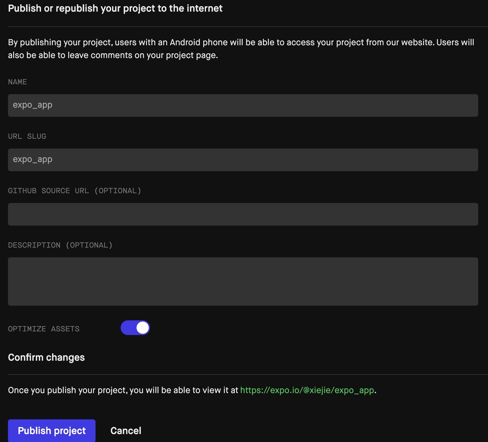
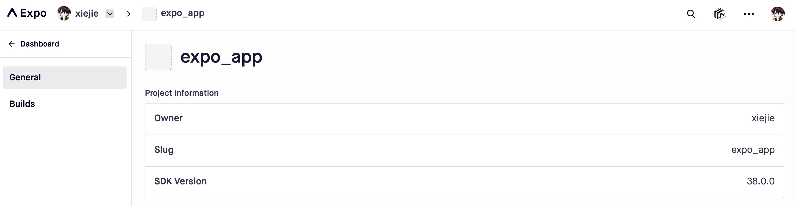
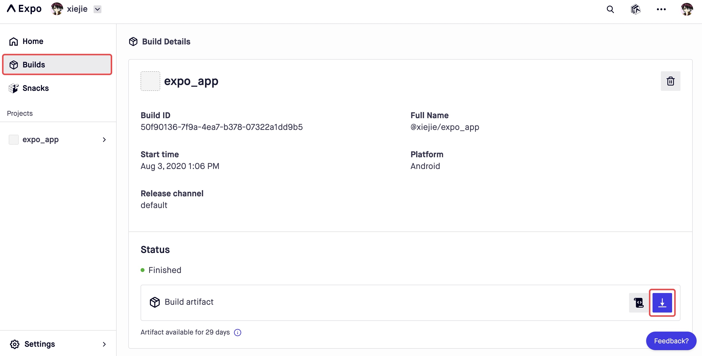
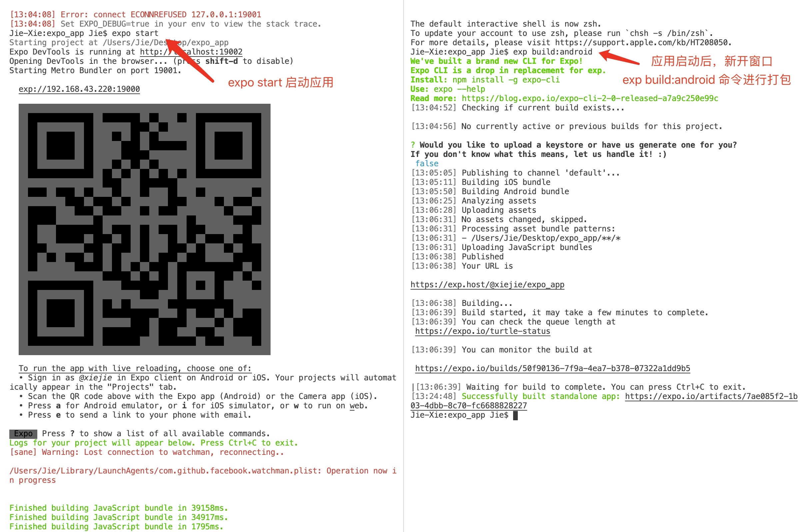

# Expo 环境应用打包

## 概述

+ 在 expo 中要打包项目非常简单。启动项目后，在浏览器端的控制台页面，选择“Publish or republish project”选项

  

+ 在右边的面板中，填写对应的信息

  

+ 之后点击【Publish project】按钮进行打包。打包完成后，会在控制台提示我们打包已经完成

  

+ 当出现该提示时，说明打包的应用已被放到 expo 官网了。访问这个链接，可以看到我们发布的项目

  

+ 点击【Builds】，可以看到打包后的应用的详细信息，在【Status】那一栏提供了下载链接，我们可以下载打包好的 apk 文件，来进行发布

  

## 命令形式打包

+ 当然，我们也可以通过命令的形式来进行打包，在 app.json 文件中，可以进行更加详细的配置

  ```json
  {
    "expo": {
      "name": "expo_app",
      "slug": "expo_app",
      "version": "1.0.0",
      "orientation": "portrait",
      "icon": "./assets/icon.png",
      "splash": {
        "image": "./assets/splash.png",
        "resizeMode": "contain",
        "backgroundColor": "#ffffff"
      },
      "sdkVersion": "38.0.0",
      "updates": {
        "fallbackToCacheTimeout": 0
      },
      "assetBundlePatterns": [
        "**/*"
      ],
      "ios": {
        "supportsTablet": true
      },
      "web": {
        "favicon": "./assets/favicon.png"
      },
      "android": {
        "package": "com.test.expo_app"
      },
      "description": ""
    }
  }
  ```

+ 在该配置文件中，主要就是配置了应用的图标、版本等信息。

+ 详细的配置选项，可以参阅：https://docs.expo.io/versions/latest/config/app/

+ 接下来通过 expo start 启动应用，然后新开一个窗口，通过 exp build:android 来进行打包

  + 注：所以在上面的 app.json 中，一定要有 android 这个配置项

+ 具体操作如下图所示：

  

+ 整个打包过程会比较长，因为应用也会先被存储到 expo 官网

+ 打包完成后，expo 会给我们一个链接，通过该链接可以下载打包的 apk 文件，然后就可以进行发布了
