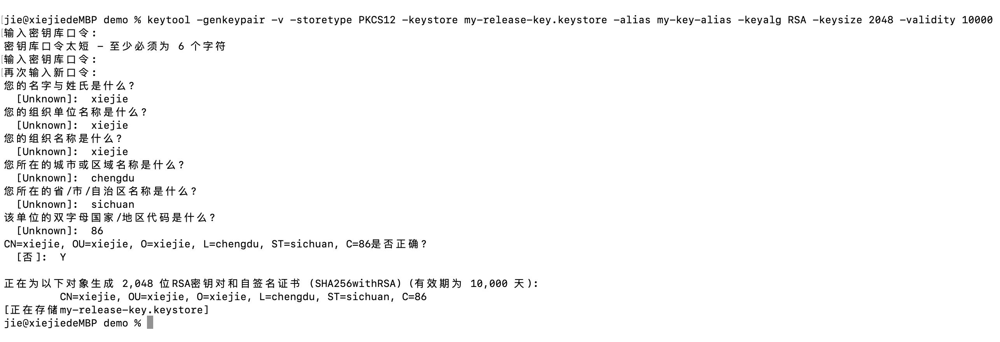
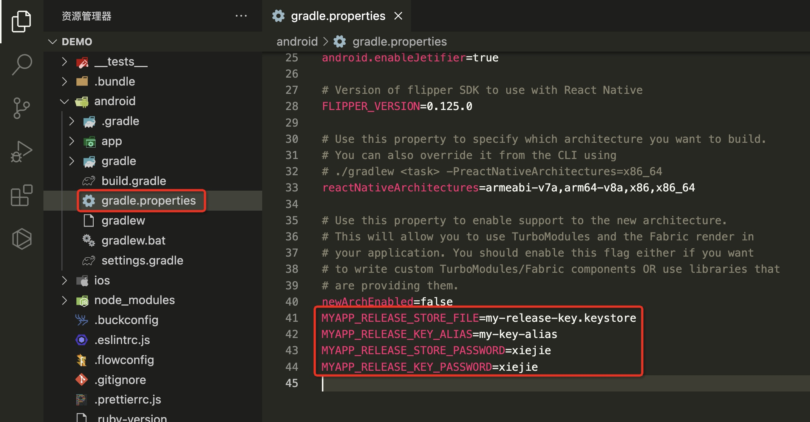
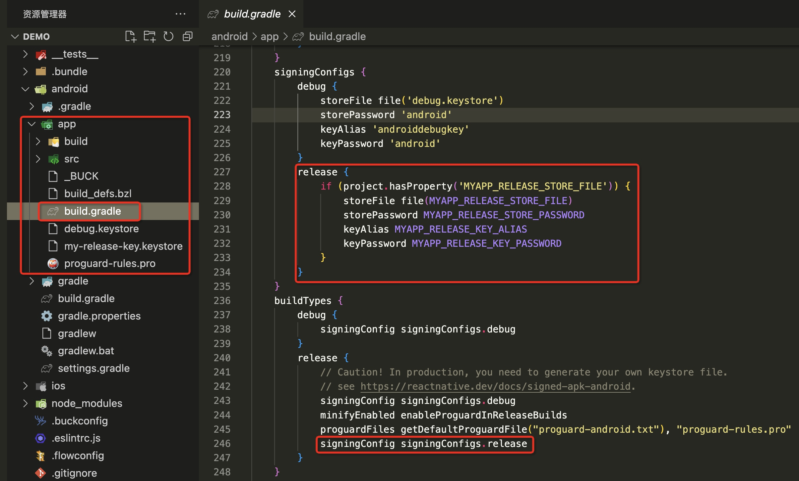
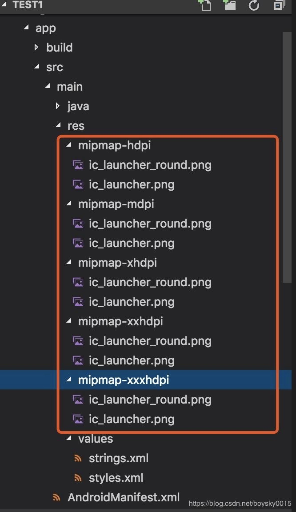

# React Native CLI 环境项目应用打包

## 概述

+ Android 要求所有应用都有一个数字签名才会被允许安装在用户手机上，所以在把应用发布到应用市场之前，你需要先生成一个签名的 AAB 或 APK 包（Google Play 现在要求 AAB 格式，而国内的应用市场目前仅支持 APK 格式。但无论哪种格式，下面的签名步骤是一样的）

## 生成一个签名密钥

+ 你可以用keytool命令生成一个私有密钥
+ 在 Windows 上keytool命令放在 JDK 的 bin 目录中（比如C:\Program Files\Java\jdkx.x.x_x\bin），你可能需要在命令行中先进入那个目录才能执行此命令

  ```bash
  keytool -genkeypair -v -storetype PKCS12 -keystore my-release-key.keystore -alias my-key-alias -keyalg RSA -keysize 2048 -validity 10000
  ```

+ 这条命令会要求你输入密钥库（keystore）和对应密钥的密码，然后设置一些发行相关的信息。最后它会生成一个叫做 my-release-key.keystore 的密钥库文件。

+ 在运行上面这条语句之后，密钥库里应该已经生成了一个单独的密钥，有效期为 10000 天。--alias 参数后面的别名是将来为应用签名时所需要用到的，所以记得记录这个别名。

+ 切换目录到项目根目录下，具体操作如下图所示

  

+ 注意：请记得妥善地保管好你的密钥库文件，一般不要上传到版本库或者其它的地方

## 设置 gradle 变量

+ 步骤1 把my-release-key.keystore文件放到你工程中的android/app文件夹下。

+ 步骤2 编辑~/.gradle/gradle.properties（全局配置，对所有项目有效）或是项目目录/android/gradle.properties（项目配置，只对所在项目有效）。如果没有gradle.properties文件你就自己创建一个，添加如下的代码（注意把其中的****替换为相应密码）

  + 注意：~符号表示用户目录，比如 windows 上可能是C:\Users\用户名，而 mac 上可能是/Users/用户名

  ```bash
  MYAPP_RELEASE_STORE_FILE=my-release-key.keystore
  MYAPP_RELEASE_KEY_ALIAS=my-key-alias
  MYAPP_RELEASE_STORE_PASSWORD=*****
  MYAPP_RELEASE_KEY_PASSWORD=*****
  ```

  

+ 其中最后两行的 PASSWORD 要替换为上面在创建 my-release-key.keystore 的密钥库文件时所输入的密码

## 把签名配置加入到项目的 gradle 配置中

+ 编辑你项目目录下的android/app/build.gradle，添加如下的签名配置：

  ```js
  ...
  android {
      ...
      defaultConfig { ... }
      signingConfigs {
          release {
              if (project.hasProperty('MYAPP_RELEASE_STORE_FILE')) {
                  storeFile file(MYAPP_RELEASE_STORE_FILE)
                  storePassword MYAPP_RELEASE_STORE_PASSWORD
                  keyAlias MYAPP_RELEASE_KEY_ALIAS
                  keyPassword MYAPP_RELEASE_KEY_PASSWORD
              }
          }
      }
      buildTypes {
          release {
              ...
              signingConfig signingConfigs.release
          }
      }
  }
  ...
  ```

  

## 生成发行 APK 包

+ 只需在终端中运行以下命令

  ```bash
  $ cd android
  $ ./gradlew assembleRelease
  ```

  + cd android表示进入 android 目录（如果你已经在 android 目录中了那就不用输入了）。

+ 打包成功

  

+ 最终，打包好的 apk 文件存放于 项目根目录/android/app/build/outputs/apk/release/

## 修改 APP 名称与图标

+ 一般来讲，我们需要替换掉默认的应用图标和名称

  + 修改 app 的名称：在 android/src/main/res/values/strings.xml

  ```html
  <resources>
    <string name="app_name">你的应用名称</string>
  </resources>
  ```

+ 修改 app 图标：在 android/src/main/res/mipmap-* 里面的图片全部换成自己的图片

  

+ 替换之后重新打包项目即可
