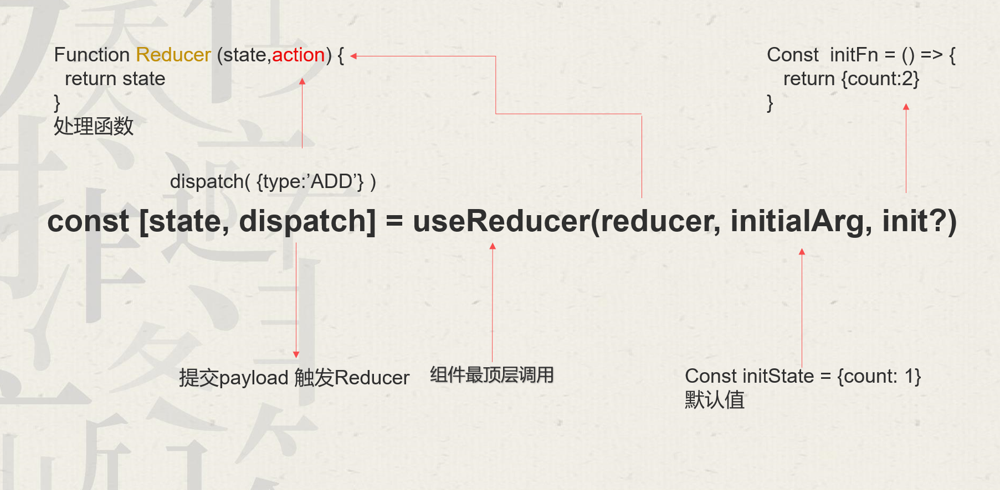

# useReducer

## 概述

+ useReducer 是一个 React Hook，它允许你向组件里面添加一个 reducer

  ```js
  const [state, dispatch] = useReducer(reducer, initialArg, init?)
  ```

  

  + 参数

    + reducer 用于更新 `state` 的纯函数。参数为 `state` 和 `action` ，返回值是更新后的 `state` 。 `state` 与 `action` 可以是任意合法值
    + initialArg *默认值* 用于初始化 state 的任意值。初始值的计算逻辑取决于接下来的 init 参数
    + init (可选) 用于计算初始值的函数。如果存在，使用 `init(initialArg)` 的执行结果作为初始值，否则使用 `initialArg`

  + 返回值

    + state 当前的 state。初次渲染时，它是 init(initialArg) 或 initialArg （如果没有 init 函数）
    + dispatch 用于更新 state 并触发组件的重新渲染。

  ```js
  import { useReducer } from 'react';

  function reducer(state, action) {
    // ...
    return newState;
  }

  function MyComponent() {
    const [state, dispatch] = useReducer(reducer, { age: 42 });
    // ...
  ```

## 注意事项

+ useReducer 是一个 Hook，所以只能在 组件的顶层作用域 或自定义 Hook 中调用，而不能在循环或条件语句中调用。如果你有这种需求，可以创建一个新的组件，并把 state 移入其中

+ 严格模式下 React 会 调用两次 reducer 和初始化函数，这可以 帮助你发现意外的副作用。这只是开发模式下的行为，并不会影响生产环境。只要 reducer 和初始化函数是纯函数（理应如此）就不会改变你的逻辑。其中一个调用结果会被忽略

## useReducer 使用

+ 代码

  ```js
  import React,{ useState, useReducer } from 'react'

  function nReducer(state, {type, payload}) {
    switch (type) {
      case 'add':
        return state + 1;

      case 'dec':
        if(state <= 0) {
          return 0
        } else {
          return state - 1;
        }

      default:
        return state
    }
  }

  const Reducer = () => {
    // 使用
    const [n, dispatch] = useReducer(nReducer, 0);

    return (
      <div>
        <button onClick={ () => { dispatch({type: 'dec'}) } }>减少</button>
        <p>{ n }</p>
        <button onClick={ () => { dispatch({type: 'add'}) } }>增加</button>
      </div>
    )
  }

  export default Reducer
  ```

+ `useReducer` 第三个参数的使用。会将第**二**个参数传入第三个函数的**参数**中，然后第三个函数的返回值作为默认值

  ```js
  const [n, dispatch] = useReducer(nReducer, 10, (asg) => {
    return 100
  });
  ```

## 源码

+ 代码

  ```js
  import React, { useState } from 'react'
  /**
   * @param {function} reduccer reducer 函数，标准格式 {type: '...', payload: '...'}
    * @param {any} initialState 初始状态
    * @param {function} initFun (可选参数) 用于计算初始值，将 initialState 作为参数，返回结果作为初始值
    */
  function useReducer (reduccer, initialState, initFun) {
    // const [n, setN] = useState(0);
    const [state, setState] = useState(initFun ? initFun(initialState) : initialState);

    function dispatch(action) {
      const newState = reducer(state, action);
      console.log(`日志：n的值从${state}变化到${newState}`);
      setState(newState)
    }

    return [state, dispatch]
  }
  ```
