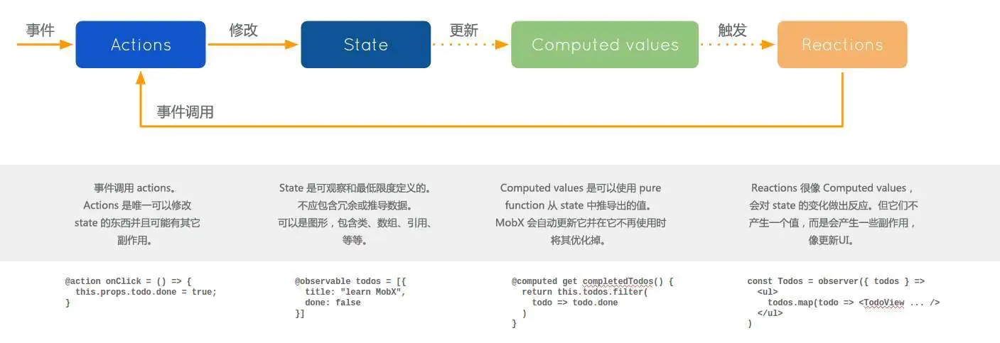

# Mobx

## 介绍

+ MobX 是由 Mendix、Coinbase 和 Facebook 开源的状态管理框架

+ MobX 背后的哲学是

  + 任何源自应用状态的东西都应该自动地获得

+ 意思就是，当状态改变时，所有应用到状态的地方都会自动更新。它通过响应式函数编程来实现状态的存储和管理
+ 受到面向对象编程和响应式编程的影响，Mobx 可以将状态包装成可观察对象，通过观察和修改对象的状态进而实现视图的更新

## MobX 的核心概念

+ State: 驱动应用的数据
+ Computed values: 计算值。如果你想创建一个基于当前状态的值时，请使用 computed
+ Reactions: 反应，当状态改变时自动发生
+ Actions: 动作，用于改变 State
+ 依赖收集（autoRun）: MobX 中的数据以来基于观察者模式，通过 autoRun 方法添加观察者

  

## MobX 的特点

+ 数据流流动不自然，只有用到的数据才会引发绑定，局部精确更新（细粒度控制）
+ 没有时间回溯能力，因为数据只有一份引用
+ 基于面向对象
+ 往往是多个 Store
+ 代码侵入性小
+ 简单可扩展
+ 大型项目使用 MobX 会使得代码难以维护

