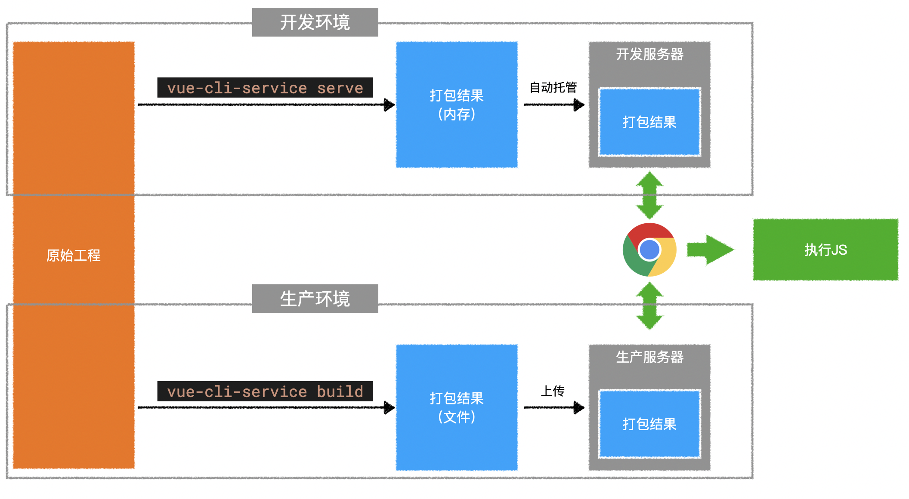

# 基础

## 模式和环境变量

+ 详见vue-cli官网[模式和环境变量](https://cli.vuejs.org/zh/guide/mode-and-env.html#%E6%A8%A1%E5%BC%8F%E5%92%8C%E7%8E%AF%E5%A2%83%E5%8F%98%E9%87%8F)

+ vue-cli在打包时，会将process.env.XXX进行替换

+ 
+ 

## 环境变量定义

1. 首先读取当前机器的环境变量

    ```js
    // 开发环境
    process.env.NODE_ENV === "development"

    // 生产环境
    process.env.NODE_ENV === "production"
    ```

2. 读取.env文件

  ```text
  目录
  .env 所有环境中读取
  .env.development 只会在开发环境中读取
  .env.production 只会在生产环境中读取
  ```

## 命名方式

+ 命名：`VUE_APP_xxx`

  ```text
  .env.development 文件

  VUE_APP_SERVERBASE=http://www.test.com
  ```

+ 使用 `process.env.VUE_APP_xxx`

  ```js
  process.env.VUE_APP_xxx
  ```
