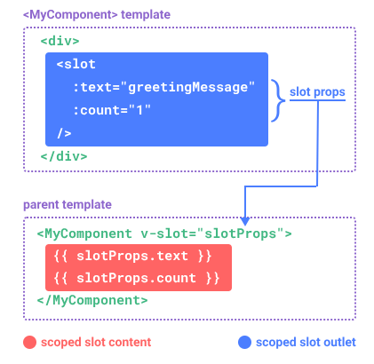

# 作用域插槽

## 概述

+ 父组件

  ```html
  <!-- 可以像对组件传递 props 那样，向一个插槽的出口上传递 attributes -->
  <!-- <MyComponent> 的模板 -->
  <div>
    <slot :text="greetingMessage" :count="1"></slot>
  </div>
  ```

## 默认插槽接收插槽 props

+ 通过子组件标签上的 `v-slot` 指令，直接接收到了一个插槽 `props` 对象

  

  ```html
  <MyComponent v-slot="slotProps">
    {{ slotProps.text }} {{ slotProps.count }}
  </MyComponent>
  ```

+ 也可以在 `v-slot` 中使用解构

  ```html
  <MyComponent v-slot="{ text, count }">
    {{ text }} {{ count }}
  </MyComponent>
  ```

## 具名插槽接收插槽 props

+ 向具名插槽中传入 `props`

  ```html
  <slot name="header" message="hello"></slot>
  ```

+ 注意插槽上的 name 是一个 Vue 特别保留的 attribute，不会作为 `props` 传递给插槽
+ 因此最终 headerProps 的结果是 `{ message: 'hello' }`

## 同时使用了具名插槽与默认插槽

+ 则需要为默认插槽使用显式的 `<template>` 标签

  ```html
  <template>
    <MyComponent>
      <!-- 使用显式的默认插槽 -->
      <template #default="{ message }">
        <p>{{ message }}</p>
      </template>

      <template #footer>
        <p>Here's some contact info</p>
      </template>
    </MyComponent>
  </template>
  ```
