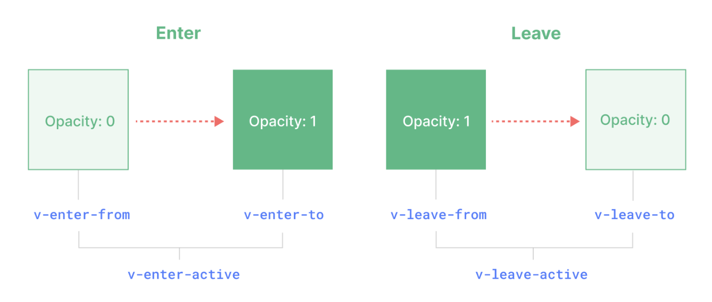

# 样式类

## 分类

+ Transition 样式类有 6 个，分别对应两大阶段

  

+ 进入

  + `v-enter-from`
  + `v-enter-to`
  + `v-enter-active`

+ 离开

  + `v-leave-from`
  + `v-leave-to`
  + `v-leave-active`

## 进入

+ Vue 会在元素插入之前，自动的挂上 `v-enter-from` 以及 `v-enter-active` 类，类似于：

  ```html
  <div v-if="show" class="v-enter-from v-enter-active">
    <h1>动画</h1>
    <p>淡入淡出</p>
  </div>
  ```

+ 元素插入完成后，会移除 `v-enter-from` 样式类，然后插入 `v-enter-to` ，类似于

  ```html
  <div v-if="show" class="v-enter-to v-enter-active">
    <h1>动画</h1>
    <p>淡入淡出</p>
  </div>
  ```

+ 也就是说，整个从插入前到插入后， `v-enter-active` 样式类是一直有的，不过插入前会挂载 `v-enter-from` ，插入后会挂载 `v-enter-to`

+ 而这 3 个样式类所对应的样式分别是

  + v-enter-from：opacity: 0;
  + v-enter-to：opacity: 1;
  + v-enter-active：transition: opacity 3s;

+ 这就自然出现了淡入淡出的效果。当整个过渡效果结束后，这 3 个辅助样式类会一并被移除掉
