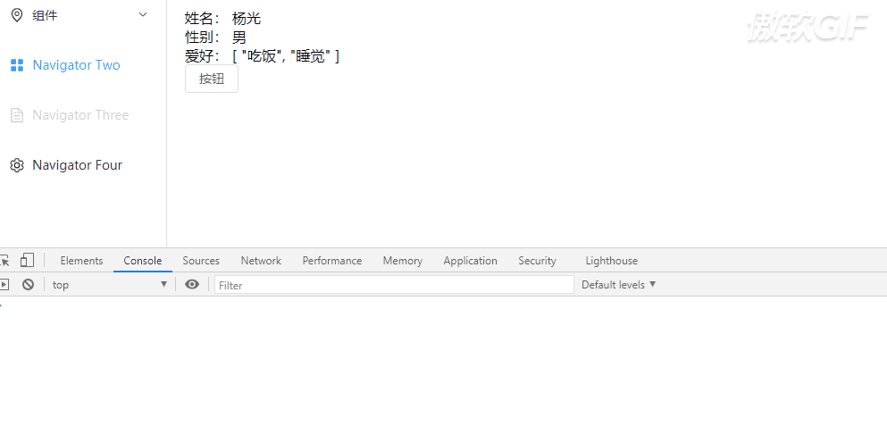

# markRaw

## 概述

+ 将一个对象标记为不可以被转化为代理对象
+ 返回该对象本身

## 应用场景

1.有些值不应被设置成响应式时,例如复杂的第三方类库等
2.当渲染具有不可变数据源的大列表时,跳过响应式转换可以提高性能
3.在动态渲染组件的时候我们就可以使用 markRaw 包裹

  ```js
  const myComponentsList = shallowRef<any[]>([]);
    const init = () => {
    // 导入当前所有子组件
    const modules = import.meta.glob(
        "@/views/animejs/TargetAndAttribute/cmp/*.vue",
        {
        eager: true,
        },
    );

    myComponentsList.value = Object.values(modules).map(item => {
        // @ts-ignore
        return item.default;
    });
    };

    onMounted(() => {
    init();
    });
  ```

## markRaw 的使用场景

+ 很多时候，我们会遇见这样的场景，有一个响应式对象person，这个响应式对象有很多的属性，但是呢？个别属性是不需要响应式的

  ```js
  import { reactive,markRaw } from 'vue'
  let person:any = reactive({
    name: "杨光",
    sex:'男',
  });
  var likes = ['吃饭','睡觉'];
  // 往响应式对象中新增一个likes属性，该属性是响应式
  // 但是我们使用markRaw包裹后这个likes属性值是不具有响应式的
      person.likes = markRaw(likes);
  // 因此试图是不会更新的
  var change = () => {
      person.likes[0]= '我要吃饭';
      person.likes[1]= '我要睡觉';
      console.log(person.likes);
  };
  ```

## 注意

+ 如果你只直接更改被markRaw包裹的对象，视图是不会发生改变的
+ 但是如果你下先更改没有被markRaw包裹的属性，然后在更改被markRaw包裹的对象，这个时候视图就会发生改

  ```js
  import { reactive,markRaw } from 'vue'
  let person:any = reactive({
      name: "杨光",
      sex:'男',
      likes:['吃饭','睡觉']
  });

  let likes = ['吃饭','睡觉'];
  person.likes = markRaw(likes);
  let canChange = () => {
      person.name='发生改变了'
      person.likes[0]= '我要吃饭';
      person.likes[1]= '我要睡觉';
      console.log(person.likes);
  };
  ```

  

