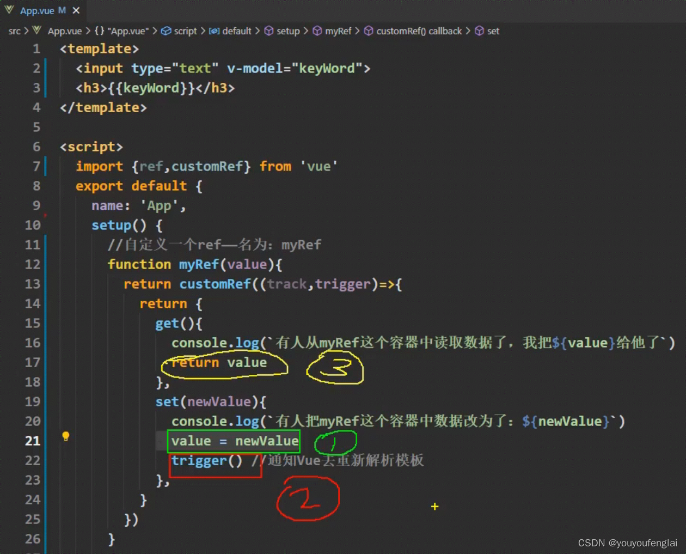

# 基础

## 概述

+ 创建一个自定义的 ref，显式声明对其依赖追踪和更新触发的控制方式

+ `customRef()` 预期接收一个工厂函数作为参数，这个工厂函数接受 `track`（依赖收集） 和 `trigger` （派发更新） 两个函数作为参数，并返回一个带有 `get` 和 `set` 方法的对象

+ 一般来说，`track()` 应该在 `get()` 方法中调用，而 `trigger()` 应该在 `set()` 中调用
+ 然而事实上，你对何时调用、是否应该调用他们有完全的控制权

+ 函数myRef接收到的参数value相当于一个变量，在函数中也可以修改它的值
+ 在set函数中，将新的值赋给了这个value，然后执行trigger方法，trigger方法会通知vue重新解析模板，此时模板中用到数据的地方将重新读取数据，即重新执行get方法获取数据

  

  ```js
  import {customRef } from 'vue'

  // 自定义一个 ref 名为myRef
  const myRef = (value) => {
    return customRef((track, trigger) => {
      return {
        get() {
          // 有人从 myRef 这个容器中读取数据了，我把 value 给了它

          // 依赖收集
          track(); // 通知 vue 追踪 vulue 的变化
          return value;
        },
        set(newValue) {
          // 有人把 myRef 这个容器中的数据改为了 newValue
          value = newValue
          trigger(); // 通知 Vue 去重新解析模板
        }
      }
    })
  }
  ```

## 使用场景

+ 防抖/节流

  + 在用户输入或滚动事件中，频繁触发的事件可能会导致性能问题
  + 使用customRef可以实现防抖或节流功能，从而减少不必要的计算和渲染
  + 例如，在搜索框输入时，可以设置一个延迟时间来防止每次键盘输入都触发搜索请求

+ 异步更新

  + 当需要根据某个异步操作的结果来更新响应式数据时，可以使用customRef来实现
  + 例如，从服务器获取数据并更新UI元素

+ 条件性更新

  + 在某些情况下，可能希望只有当满足特定条件时才更新视图
  + 通过customRef，可以在set方法中添加逻辑判断，仅在条件满足时才触发更新

+ 精细控制依赖追踪

  + 对于复杂的依赖关系，可能需要更细粒度的控制
  + customRef允许显式地标记依赖项和触发更新，适用于需要精确控制响应式行为的场景

+ 优化性能

  + 通过避免不必要的响应式转换和更新，customRef可以帮助提高应用的性能
  + 特别是在处理大量数据或高频更新的情况下

