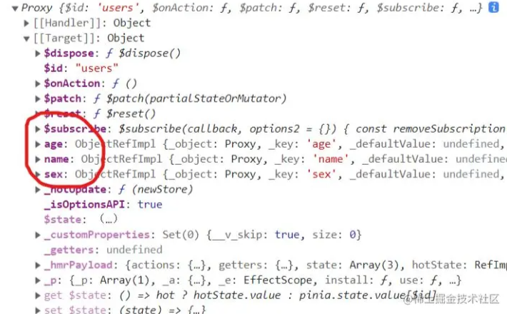

# state 操作

## 添加

+ state接收的是一个箭头函数返回的值，它不能直接接收一个对象

+ 代码

  ```js
  export const useUsersStore = defineStore("users", {
    // 为了完整类型推理，推荐使用箭头函数
    state: () => {
      // // 所有这些属性都将自动推断出它们的类型
      return {
        name: "小猪课堂",
        age: 25,
        sex: "男",
      };
    },
  });
  ```

  

## 读取

+ 代码

  ```html
  <template>
    
    <p>姓名：{{ name }}</p>
    <p>年龄：{{ age }}</p>
    <p>性别：{{ sex }}</p>
  </template>

  <script setup lang="ts">
    import { ref } from "vue";
    import { useUsersStore } from "../src/store/user";
    const store = useUsersStore();
    const name = ref<string>(store.name);  // 非响应式
    const age = ref<number>(store.age);  // 非响应式
    const sex = ref<string>(store.sex);  // 非响应式
  </script
  ```

+ 解构获取值

  ```js
  import { useUsersStore } from "../src/store/user";
  const store = useUsersStore();
  const { name, age, sex } = store; // 非响应式
  ```

## 修改

+ 修改数据为响应式 `storeToRefs`

  ```js
  import { storeToRefs } from 'pinia';

  const store = useUsersStore();
  const { name, age, sex } = storeToRefs(store);
  ```

  ```js
  <template>
    <h1>我是child组件</h1>
    <p>姓名：{{ name }}</p>
    <p>年龄：{{ age }}</p>
    <p>性别：{{ sex }}</p>
    <button @click="changeName">更改姓名</button>

  </template>
  <script setup lang="ts">
    import { useUsersStore } from "../src/store/user";
    import { storeToRefs } from 'pinia';
    const store = useUsersStore();
    const { name, age, sex } = storeToRefs(store);
    const changeName = () => {
      store.name = "小猪课堂";
      store.age = age.value + 1;
    };
  </script>
  ```

## 重置 state

+ 有时候我们修改了 `state` 数据，想要将它还原
+ 直接调用 `store` 的 `$reset()` 方法即可

  ```js
  <button @click="reset">重置store</button>

  // 重置store
  const reset = () => {
    store.$reset();
  };
  ```

## 批量更新state

+ 使用 `store` 的 `$patch` 方法

+ 方法1：缺点就是必须要将state中的所有字段例举出了

  ```js
  <button @click="patchStore">批量修改数据</button>

  // 批量修改数据
  const patchStore = () => {
    store.$patch({
      name: "张三",
      age: 100,
      sex: "女",
    });
  };
  ```

+ 方法2：pinia提供的 `$patch` 方法还可以接收一个回调函数

  ```js
  store.$patch((state) => {
    state.items.push({ name: 'shoes', quantity: 1 })
    state.hasChanged = true
  })
  ```

## 替换整个state

+ pinia提供了方法让我们直接替换整个 `state` 对象，使用 `store` 的 `$state` 方法
+ 你不能完全替换掉 store 的 state，因为那样会破坏其响应性
+ 但是，你可以 patch 它

  ```js
  // 这实际上并没有替换`$state`
  store.$state = { count: 24 }
  // 在它内部调用 `$patch()`：
  store.$patch({ count: 24 })
  ```

## TS

+ 方法1：指定类型

  ```js
  const useStore = defineStore('storeId', {
    state: () => {
      return {
        // 用于初始化空列表
        userList: [] as UserInfo[],
        // 用于尚未加载的数据
        user: null as UserInfo | null,
      }
    },

  })

  interface UserInfo {
    name: string
    age: number
  }
  ```

+ 方法2：接口定义 state，并添加 state() 的返回值的类型

  ```js
  interface State {
    userList: UserInfo[]
    user: UserInfo | null
  }

  interface UserInfo {
    name: string
    age: number
  }

  const useStore = defineStore('storeId', {
    state: (): State => {
      return {
        userList: [],
        user: null,
      }
    },
  })
  ```
