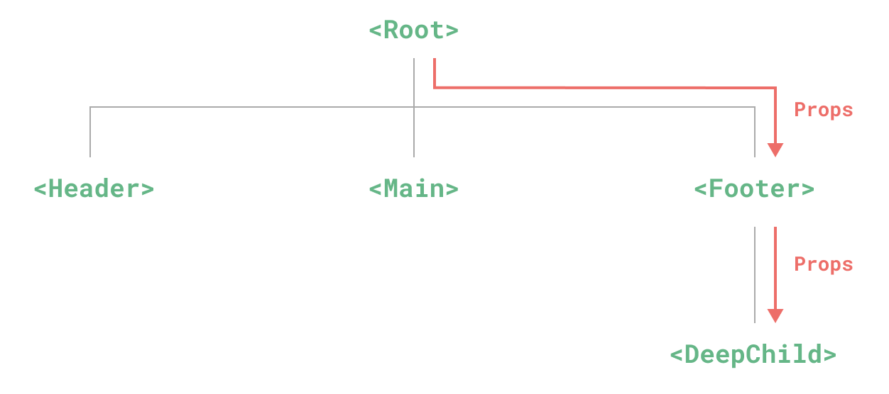

# Provide与Inject

## 概述

+ Props 逐级传递存在的问题

  

+ 整个依赖注入分为两个角色

  + 提供方：负责提供数据
  + 注入方 ：负责接收数据

## 提供方 provide

+ 要提供数据，可以使用 provide 方法

  ```js
  import { provide } from 'vue';

  provide(/* 数据名称 */ 'message', /* 实际数据 */ 'hello!');
  provide('message', 'hello!');
  ```

+ 该方法接收的参数也很简单

  + 数据对应的名称
  + 实际的数据

## 注入方 inject

+ 注入方通过 inject 方法来取得数据

  ```js
  import { inject } from 'vue'

  const message = inject('message');
  ```

## 示例

+ 一级组件

  ```html
  <template>
    <div>
      <h1>一级组件</h1>
      <二级组件 />
    </div>
  </template>

  <script setup>
  import 二级组件 from "./cmp/二级组件.vue"
  import { provide } from 'vue';

  const a = "一级组件的数据";
  provide('一级组件Data', a);
  </script>
  ```

+ 二级组件

  ```html
  <template>
    <div>
      <h2>二级组件</h1>
      <三级组件 />
    </div>
  </template>
  ```

+ 三级组件

  ```html
  <template>
    <h3>三级组件 {{ message }}</h1>
  </template>

  <script setup>
  import { inject } from 'vue';

  const message = inject('一级组件Data');
  </script>
  ```
