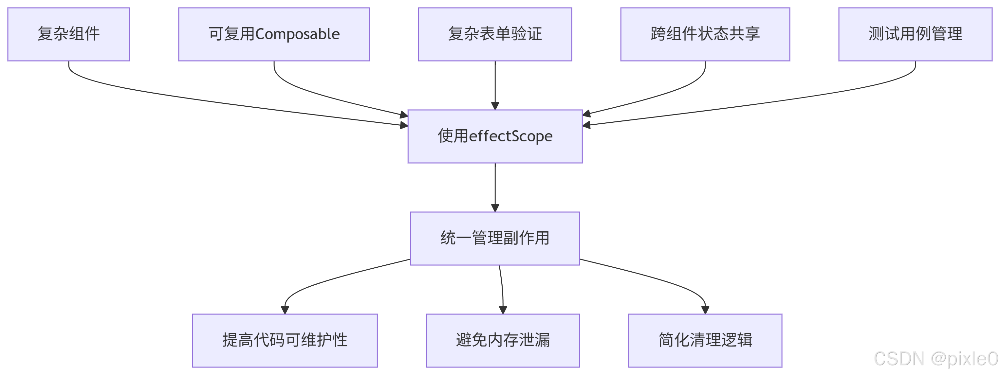

# effectScope

## 概述

+ Vue3 中的api `effectScope`
+ Pinia 的底层原理就是依赖了 effectScope

+ 调用effectScope函数可以创建独立作用域

+ 用于将多个响应式副作用（effect、watch、computed 等）包裹在一个独立的作用域中，实现批量管理

  + 当作用域被销毁时，内部所有副作用会被自动清理，避免内存泄漏并简化代码逻辑

## effectScope 的核心价值

+ 批量管理：批量管理副作用生命周期，替代手动调用多个 stop()，简化代码逻辑
+ 避免泄漏：组合函数可自主管理内部副作用，向调用者暴露简洁的控制接口，防止内存泄漏
+ 灵活层级：嵌套作用域链式停止，天然支持逻辑树状结构，符合组件化设计思维
+ 架构清晰：为复杂功能建立明确的资源管理边界

## API

+ `function effectScope(detached?: boolean): EffectScope`

  ```js
  interface EffectScope {
    run<T>(fn: () => T): T | undefined
    stop(): void
    pause():void
    resume():void
    active: boolean
  }
  ```

+ 参数

  + detached (可选): 是否创建独立作用域（默认false）

    + false: 嵌套在父作用域中，父作用域停止时会自动停止子作用域
    + true: 独立作用域，不受父作用域影响

+ 返回值：

  + run(): 执行函数并捕获其中创建的所有副作用
  + stop(): 停止作用域内所有副作用
  + pause():暂停作用域内所有副作用（可恢复）
  + resume():恢复被暂停的所有副作用
  + active: 作用域是否处于活动状态（未停止）

## onScopeDispose

+ onScopeDispose是一个注册回调函数的方法，该回调会在所属的 effectScope 被停止 (scope.stop()) 时执行

  ```js
  import { onScopeDispose } from 'vue';

  const scope = effectScope();
  scope.run(() => {
    const count = ref(0);
    //定时器计数
    let intervalId = setInterval(() => {
      count.value++;
      console.log(count.value, "count");
    }, 1000);
    watchEffect(() => {
      console.log(count.value, "Count changed");
    });

    //在作用域停止时清理定时器
    onScopeDispose(() => {
      clearInterval(intervalId);
    });
  });

  // 当调用 stop 时，作用域内定时器会被清理
  scope.stop();

  ```

## 场景

+ 包含3个以上副作用的组件
+ 需要管理定时器/事件监听的可复用逻辑
+ 涉及多个响应式依赖的复杂表单
+ 需要在组件间共享的有状态逻辑
+ 需要精确控制副作用的测试用例

  

## 总结

+ effectScope是管理复杂副作用的终极解决方案

+ 通过它，您可以：

  + 将相关副作用组织到逻辑单元中
  + 通过单个stop()调用清理所有资源
  + 创建自包含的可复用逻辑单元
  + 确保组件卸载时完全清理
  + 简化测试和状态管理
