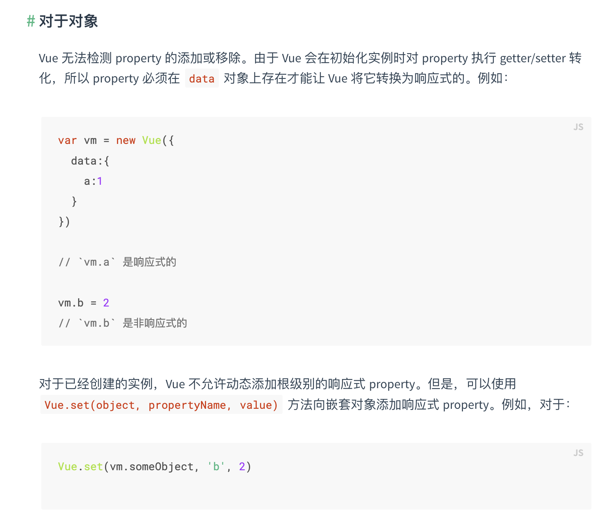

# 数据拦截的方式

## Object.defineProperty

+ 对应 Vue1.x、2.x 响应式

## Proxy

+ 对应 Vue3.x 响应式

## 两者共同点

+ 共同点1  都可以针对对象成员拦截

  + 无论使用哪一种方式，都能拦截读取操作

    ```js
    const obj = {};
    let _data = "这是一些数据";
    Object.defineProperty(obj, "data", {
      get() {
        console.log("读取data的操作被拦截了");
        return _data;
      },
    });
    console.log(obj.data);
    ```

    ```js
    const obj = {
      data: "这是一些数据",
      name: "张三"
    };
    const p = new Proxy(obj, {
      get(obj, prop) {
        console.log(`${prop}的读取操作被拦截了`);
        return obj[prop];
      },
    });
    console.log(p.data);
    console.log(p.name);
    ```

  + 两者都可以拦截写入操作：

    ```js
    const obj = {};
    let _data = "这是一些数据";
    Object.defineProperty(obj, "data", {
      get() {
        console.log("读取data的操作被拦截了");
        return _data;
      },
      set(value){
        console.log("设置data的操作被拦截了");
        _data = value;
      }
    });
    obj.data = "这是新的数据";
    console.log(obj.data);
    ```

    ```js
    const obj = {
      data: "这是一些数据",
      name: "张三"
    };
    const p = new Proxy(obj, {
      get(obj, prop) {
        console.log(`${prop}的读取操作被拦截了`);
        return obj[prop];
      },
      set(obj, prop, value) {
        // 前面相当于是拦截下这个操作后，我们要做的额外的操作
        console.log(`${prop}的设置操作被拦截了`);
        // 后面就是真实的操作
        obj[prop] = value;
      }
    });
    p.data = "这是新的数据";
    p.name = "李四";
    ```

+ 共同点2 都可以实现深度拦截

  + 两者在实现深度拦截的时候，需要自己书写递归来实现，但是总而言之是能够实现深度拦截的

    ```js
    const data = {
      level1: {
        level2: {
          value: 100,
        },
      },
    };

    function deepDefineProperty(obj) {
      for (let key in obj) {
        // 首先判断是否是自身属性以及是否为对象
        if (obj.hasOwnProperty(key) && typeof obj[key] === "object") {
          // 递归处理
          deepDefineProperty(obj[key]);
        }
        // 缓存一下属性值
        let _value = obj[key];
        Object.defineProperty(obj, key, {
          get() {
            console.log(`读取${key}属性`);
            return _value;
          },
          set(value) {
            console.log(`设置${key}属性`);
            _value = value;
          },
          configurable: true,
          enumerable: true,
        });
      }
    }
    deepDefineProperty(data);
    console.log(data.level1.level2.value);
    console.log("----------------");
    data.level1.level2.value = 200;
    ```

    ```js
    function deepProxy(obj) {
      return new Proxy(obj, {
        get(obj, prop) {
          console.log(`读取了${prop}属性`);
          if (typeof obj[prop] === "object") {
            // 递归的再次进行代理
            return deepProxy(obj[prop]);
          }
          return obj[prop];
        },
        set(obj, prop, value) {
          console.log(`设置了${prop}属性`);
          if (typeof value === "object") {
            return deepProxy(value);
          }
          obj[prop] = value;
        },
      });
    }
    const proxyData = deepProxy(data);
    console.log(proxyData.level1.level2.value);
    console.log("----------------");
    proxyData.level1.level2.value = 200;
    ```

## 两者差异点

+ 差异1  拦截的广度

  + Vue3 的响应式，从原本的 `Object.defineProperty` 替换为了 `Proxy`
  + 之所以替换，就是因为两者在进行拦截的时候，无论是拦截的目标还是能够拦截的行为，都是不同的：

    + `Object.defineProperty` 是针对对象特定属性的读写操作进行拦截
    + `Proxy` 则是针对一整个对象的多种操作，包括属性的读取、赋值、属性的删除、属性描述符的获取和设置、原型的查看、函数调用等行为能够进行拦截

  + 如果是使用 `Object.defineProperty` ，一旦后期给对象新增属性，是无法拦截到的，因为 `Object.defineProperty` 在设置拦截的时候是针对的特定属性，所以新增的属性无法被拦截
  + 但是 `Proxy` 就不一样，它是针对整个对象，后期哪怕新增属性也能够被拦截到
  + 另外，相比 `Object.defineProperty` ， `Proxy` 能够拦截的行为也更多

    ```js
    function deepProxy(obj) {
      return new Proxy(obj, {
        get(obj, prop) {
          console.log(`读取了${prop}属性`);
          if (typeof obj[prop] === "object") {
            // 递归的再次进行代理
            return deepProxy(obj[prop]);
          }
          return obj[prop];
        },
        set(obj, prop, value) {
          console.log(`设置了${prop}属性`);
          if (typeof value === "object") {
            return deepProxy(value);
          }
          obj[prop] = value;
        },
        deleteProperty(obj, prop) {
          console.log(`删除了${prop}属性`);
          delete obj[prop];
        },
        getPrototypeOf(obj) {
          console.log("拦截获取原型");
          return Object.getPrototypeOf(obj);
        },
        setPrototypeOf(obj, proto) {
          console.log("拦截设置原型");
          return Object.setPrototypeOf(obj, proto);
        },
      });
    }
    ```

  

+ 差异2  性能上的区别

  + 大多数情况下， `Proxy` 是高效的，但是不能完全断定 `Proxy` 就一定比 `Object.defineProperty` 效率高，因为这还是得看具体的场景
  + 如果你需要拦截的操作类型较少，且主要集中在某些特定属性上，那么 `Object.defineProperty` 可能提供更好的性能

    + 但是只针对某个特定属性的拦截场景较少，一般都是需要针对一个对象的所有属性进行拦截
    + 此时如果需要拦截的对象结构复杂（如需要递归到嵌套对象）或者需要拦截的操作种类繁多，那么使用这种方式就会变得复杂且效率低下

  + 如果你需要全面地拦截对象的各种操作，那么 `Proxy` 能提供更强大和灵活的拦截能力，尽管可能有一些轻微的性能开销
