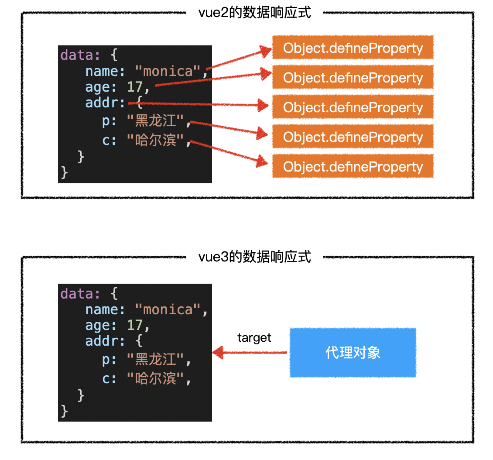

# vue3数据响应式的理解

## 面试答案

+ `vue3` 不再使用 `Object.defineProperty` 的方式定义完成数据响应式，而是使用 `Proxy`

+ 除了 `Proxy` 本身效率比 `Object.defineProperty` 更高之外，由于不必递归遍历所有属性，而是直接得到一个 `Proxy`
+ 所以在 `vue3` 中，对数据的访问是动态的，当访问某个属性的时候，再动态的获取和设置，这就极大的提升了在组件初始阶段的效率

+ 同时，由于 `Proxy` 可以监控到成员的新增和删除，因此，在 `vue3` 中新增成员、删除成员、索引访问等均可以触发重新渲染，而这些在 `vue2` 中是难以做到的

## 组件实例中的API

+ 在vue3中，组件实例是一个 `Proxy`，它仅提供了下列成员，功能和vue2一样

+ 属性：[https://v3.vuejs.org/api/instance-properties.html](https://v3.vuejs.org/api/instance-properties.html "https://v3.vuejs.org/api/instance-properties.html")

+ 方法：[https://v3.vuejs.org/api/instance-methods.html](https://v3.vuejs.org/api/instance-methods.html "https://v3.vuejs.org/api/instance-methods.html")

## 对比数据响应式

+ vue2和vue3均在相同的生命周期完成数据响应式，但做法不一样

    
